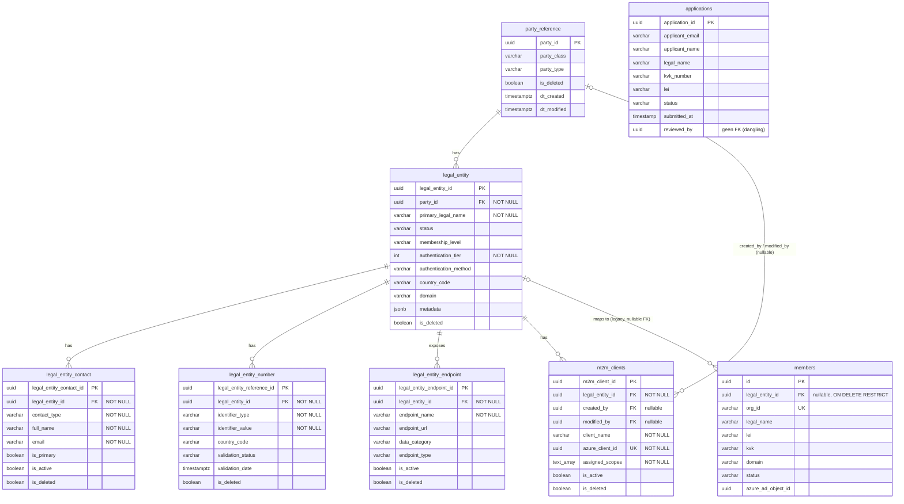
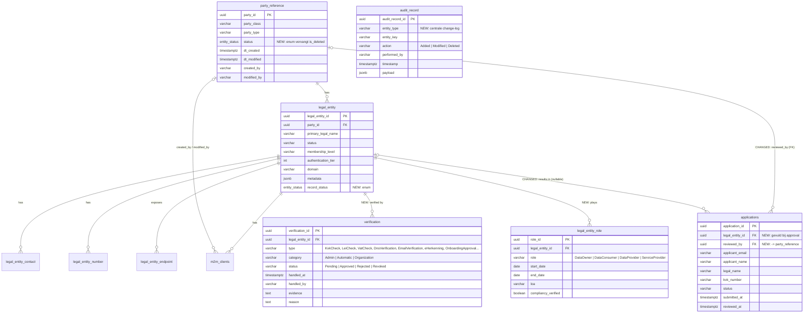

# ASR Database - Entity Relationship Diagram

**Database:** asr_dev (`psql-ctn-demo-asr-dev.postgres.database.azure.com`)
**Generated from:** `SCHEMA_REFERENCE.md`
**Conceptual lineage:** afgeleid van het Poort8 Dataspace-model (P8-CTN-ASR); intake-flow komt overeen met `Proposal` uit participant-onboarding-portal.

---

## 1. Huidige ERD (feitelijk schema)

Cardinaliteit is expliciet gemaakt: een verplichte FK = `||`, een nullable FK = `|o`.

### Aandachtspunten bij het huidige model
- **`applications` is losgekoppeld:** geen FK naar `legal_entity`, en `reviewed_by` verwijst nergens naar. De levenscyclus aanvraag → goedgekeurde entiteit is niet traceerbaar.
- **`members` (legacy):** dupliceert `legal_name`, `lei`, `kvk`, `domain`, `status`, `membership_level` die al in `legal_entity`/`legal_entity_number` staan — dubbele waarheid.
- **Gemengde conventies:** `dt_created`/`dt_modified` (core) vs `created_at`/`updated_at` (members) vs `submitted_at`+`dt_created`+`dt_updated` (applications); `created_by` is soms VARCHAR, soms UUID.
- **Verificatie is platgeslagen** tot `validation_status` op `legal_entity_number` + `authentication_tier`/`authentication_method` op `legal_entity` — geen audit-trail per check.

---

## 2. Voorgestelde toekomst-ERD

Verbeteringen geïnspireerd op het Poort8-model: verificatie en rollen als eigen entiteiten, `applications` gekoppeld, en een centrale audit-trail. Nieuwe/gewijzigde entiteiten zijn met `NEW`/`CHANGED` gemarkeerd in de relatielabels.

### Wat dit oplost
1. **`verification`** geeft een volledige, auditeerbare trail per check (NIS2/forensisch). Vervangt de losse `validation_status`-velden.
2. **`legal_entity_role`** maakt deelnemersrollen expliciet i.p.v. ze in `metadata` te verstoppen.
3. **Gekoppelde `applications`** maakt de levenscyclus aanvraag → entiteit traceerbaar; `reviewed_by` wordt een echte FK.
4. **`audit_record`** centraliseert wijzigingshistorie (zoals P8's `AuditRecord`), losgekoppeld van de business-tabellen.
5. **`entity_status`-enum** vervangt losse `is_deleted` booleans en geeft ruimte voor `Active`/`Inactive`/`Deleted` i.p.v. alleen wel/niet verwijderd.
6. **`members` (legacy)** is bewust weggelaten — deprecation-pad richting `legal_entity` + `legal_entity_number`.

---

## 3. Conceptuele mapping over de drie repo's

| Concept | DEV-CTN-ASR (Postgres) | P8-CTN-ASR (Poort8/.NET) | participant-onboarding-portal (Go) |
|---|---|---|---|
| Organisatie | `legal_entity` + `party_reference` | `Organization` (`OrOrganization`) | `Party` / `Proposal` |
| Identificatie (KvK/LEI) | `legal_entity_number` | `Property` (IsIdentifier) | velden op `Proposal` |
| Contactpersoon | `legal_entity_contact` | `Employee` | `Contact*` velden op `Proposal` |
| Endpoint/API | `legal_entity_endpoint` | `Api` / `Service` | `CapabilitiesUrl` |
| M2M client | `m2m_clients` | n.v.t. (Keycloak scopes) | `UseM2M` |
| Verificatie | `validation_status` (veld) | `Verification` + `OrganizationVerification` | `Status` op `Proposal` |
| Rollen | (geen) | `OrganizationRole` | `DataOwner/Consumer/Provider` |
| Aanvraag/intake | `applications` | `Application` + `ApiAccessRequest` | `Proposal` |
| Audit | (per-tabel timestamps) | `AuditRecord` + IMetadata | `CreatedAt` |

ASR's naamgeving (`legal_entity`, `party_reference`) sluit het dichtst aan op BDI/iSHARE.

---

## 4. Migratienotities (volgorde)

1. Voeg `verification`-tabel toe; backfill vanuit bestaande `validation_status`/`validation_date`.
2. Voeg `legal_entity_role` toe; leid rollen af uit `metadata` indien aanwezig.
3. `ALTER TABLE applications ADD COLUMN legal_entity_id uuid REFERENCES legal_entity(...)`, plus FK op `reviewed_by`.
4. Introduceer `audit_record` + triggers (of applicatie-laag) voor change-capture.
5. Uniformeer timestamp-/audit-conventies; voer `entity_status`-enum gefaseerd in naast `is_deleted`.
6. Deprecation-traject `members`: lees-only maken, daarna uitfaseren.

> Diagram-conventie: verplichte FK = `||`, nullable FK = `|o`. PK/FK/UK gemarkeerd per attribuut.
