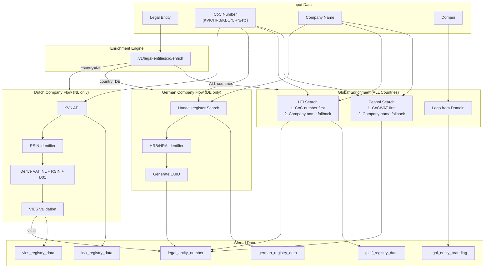
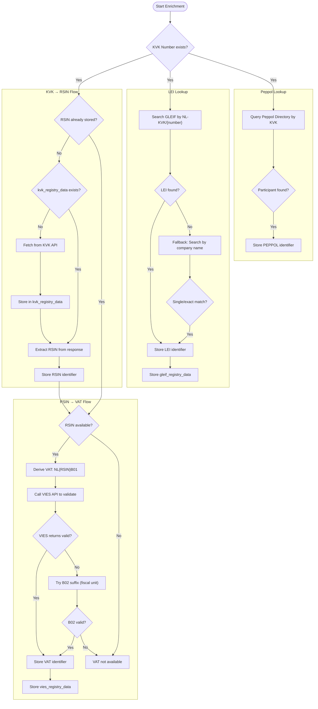
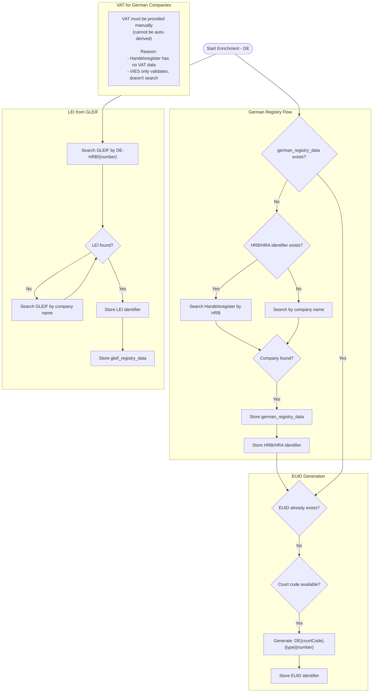
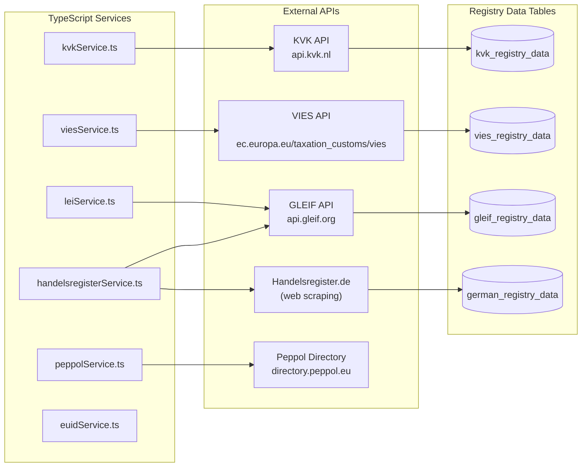
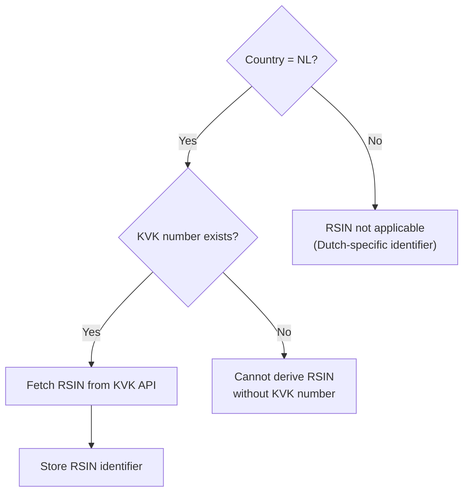
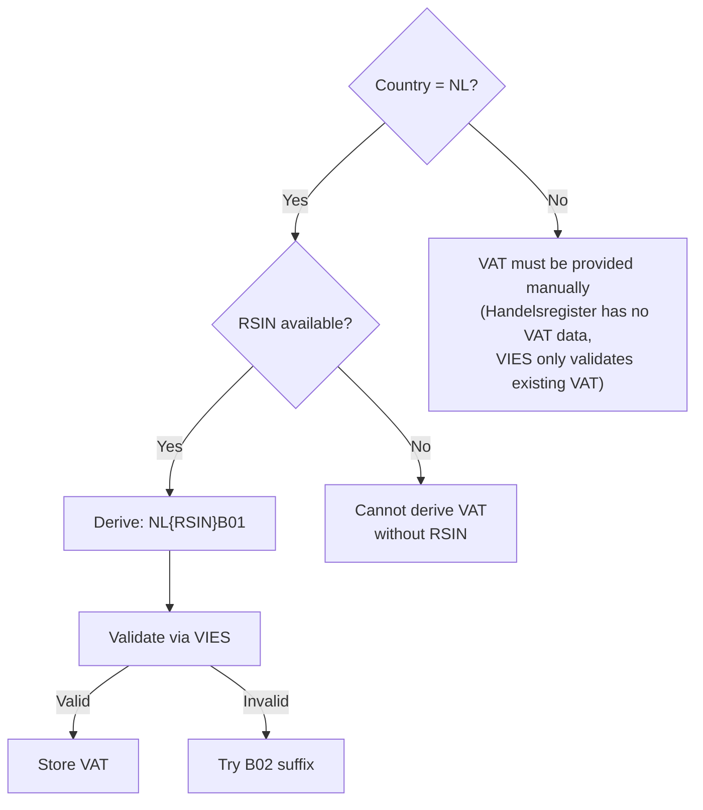
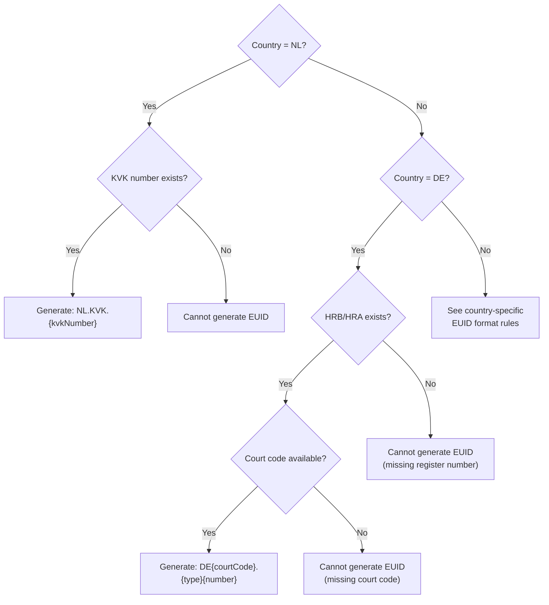

# Enrichment & Verification Architecture

**Last Updated:** 2025-12-14
**Related Code:**
- `api/src/routes.ts` - POST /v1/legal-entities/:id/enrich endpoint
- `api/src/services/enrichment/` - Extracted enrichment services

This document visualizes the data enrichment and verification flows in the ASR system.

## Key Principles

1. **LEI, Peppol, and branding apply to ALL countries** - not just NL/DE
2. **Chamber of Commerce (CoC) first, then name fallback** - LEI and Peppol search by CoC number first
3. **Country-specific flows** - RSIN/VAT for NL, HRB/EUID for DE
4. **Modular services** - Each enrichment type in its own service file

---

## High-Level Overview



---

## Dutch Company Enrichment Flow (NL)



---

## German Company Enrichment Flow (DE)



---

## External Registry Services



---

## Identifier Type Matrix

### Country-Specific Identifiers

| Country | Identifier | Source | Derivation Logic |
|---------|------------|--------|------------------|
| NL | KVK | Input | Manual entry or application |
| NL | RSIN | KVK API | Extracted from `_embedded.eigenaar.rsin` |
| NL | VAT | Derived | `NL` + `RSIN` + `B01` (or B02 for fiscal units) |
| NL | EUID | Generated | `NL.KVK.{kvkNumber}` |
| DE | HRB/HRA | Handelsregister | Scraped or manual entry |
| DE | EUID | Generated | `DE{courtCode}.{type}{number}` |
| DE | VAT | Manual | Cannot be auto-derived (Handelsregister has no VAT) |
| BE | KBO/BCE | Input | Belgian business register number |
| FR | SIRET/RCS | Input | French business register number |
| GB | CRN | Input | UK Companies House number |

### Global Identifiers (ALL Countries)

| Identifier | Source | Lookup Strategy |
|------------|--------|-----------------|
| **LEI** | GLEIF | 1. CoC number (KVK/HRB/KBO/CRN/etc) via registration authority<br>2. Company name search fallback |
| **PEPPOL** | Peppol Directory | 1. CoC/VAT by country-specific scheme<br>2. Company name + country search fallback |
| **Branding** | Domain | Google/DuckDuckGo favicon services |

### Supported CoC Types for LEI Lookup

| Type | Country | GLEIF Authority |
|------|---------|-----------------|
| KVK | NL | NL-KVK |
| HRB/HRA | DE | DE-HRB, DE-HRA |
| KBO/BCE | BE | BE-BCE |
| RCS/SIREN | FR | FR-RCS |
| CRN | GB | GB-COH |
| REA | IT | IT-REA |
| CIF | ES | ES-CIF |
| CVR | DK | DK-CVR |
| CHR | CH | CH-CHRB |

### Supported Identifiers for Peppol Lookup

| Type | Country | Peppol Scheme |
|------|---------|---------------|
| KVK | NL | 0106 |
| VAT | NL | 9944 |
| KBO | BE | 0208 |
| VAT | BE | 9925 |
| SIRET | FR | 0009 |
| CRN | GB | 0088 |
| CVR | DK | 0184 |
| VAT | DE | 9930 |

---

## EUID Format Examples

| Country | Format | Example |
|---------|--------|---------|
| Netherlands | `NL.KVK.{number}` | `NL.KVK.12345678` |
| Germany | `DE{courtCode}.{type}{number}` | `DED4601R.HRB15884` |
| Germany | `DEK1101R.{type}{number}` | `DEK1101R.HRB116737` (Hamburg) |

**German Court Codes:**
- D4601R = Amtsgericht Neuss
- K1101R = Amtsgericht Hamburg
- M1301R = Amtsgericht München
- K1704R = Amtsgericht Duisburg

---

## Decision Trees

### When is RSIN applicable?



### When can VAT be auto-derived?



### When can EUID be generated?



---

## Service Architecture (Task 18 - COMPLETED)

### Enrichment Services (NEW - extracted from routes.ts)

| Service | File | Purpose |
|---------|------|---------|
| **Orchestrator** | `api/src/services/enrichment/index.ts` | Main enrichment coordinator |
| **NL Enrichment** | `api/src/services/enrichment/nlEnrichmentService.ts` | Dutch: RSIN, VAT, KVK registry |
| **DE Enrichment** | `api/src/services/enrichment/deEnrichmentService.ts` | German: HRB/HRA, EUID generation |
| **LEI Enrichment** | `api/src/services/enrichment/leiEnrichmentService.ts` | GLEIF lookup (ALL countries) |
| **Peppol Enrichment** | `api/src/services/enrichment/peppolEnrichmentService.ts` | Peppol lookup (ALL countries) |
| **Branding** | `api/src/services/enrichment/brandingService.ts` | Logo/favicon from domain |
| **Types** | `api/src/services/enrichment/types.ts` | Shared TypeScript types |

### External API Services (existing)

| Service | File | Purpose |
|---------|------|---------|
| KVK | `api/src/services/kvkService.ts` | Dutch Chamber of Commerce API |
| VIES | `api/src/services/viesService.ts` | EU VAT validation |
| LEI | `api/src/services/leiService.ts` | GLEIF LEI lookup + storage |
| Handelsregister | `api/src/services/handelsregisterService.ts` | German commercial register |
| BundesAPI | `api/src/services/bundesApiService.ts` | Handelsregister.de scraping |
| Peppol | `api/src/services/peppolService.ts` | Peppol directory lookup |
| EUID | `api/src/services/euidService.ts` | EUID format generation |
| DNS | `api/src/services/dnsVerificationService.ts` | Domain ownership verification |

### Service Structure

```
api/src/services/
├── enrichment/                     # ENRICHMENT ORCHESTRATION (NEW)
│   ├── index.ts                    # Main orchestrator - enrichLegalEntity()
│   ├── types.ts                    # EnrichmentContext, EnrichmentResult types
│   ├── nlEnrichmentService.ts      # enrichRsin(), enrichVat(), ensureKvkRegistryData()
│   ├── deEnrichmentService.ts      # enrichGermanRegistry(), generateEuidFromExisting()
│   ├── leiEnrichmentService.ts     # enrichLei() - ALL countries via CoC or name
│   ├── peppolEnrichmentService.ts  # enrichPeppol() - ALL countries via CoC/VAT or name
│   └── brandingService.ts          # enrichBranding() - logo from domain
├── kvkService.ts                   # KVK API client
├── viesService.ts                  # VIES API client
├── leiService.ts                   # GLEIF API client + storeGleifRegistryData()
├── handelsregisterService.ts       # Handelsregister search logic
├── bundesApiService.ts             # Handelsregister.de web scraping
├── peppolService.ts                # Peppol Directory API client
└── euidService.ts                  # EUID format generation
```

### Benefits of Extraction

1. **Separation of concerns** - Each enrichment type in its own service
2. **Testability** - Services can be unit tested independently
3. **Readability** - ~100-200 lines per service vs 900+ lines inline
4. **Global scope** - LEI and Peppol now work for ALL countries, not just NL/DE
5. **Extensibility** - Easy to add new country-specific enrichments (BE, FR, etc.)
