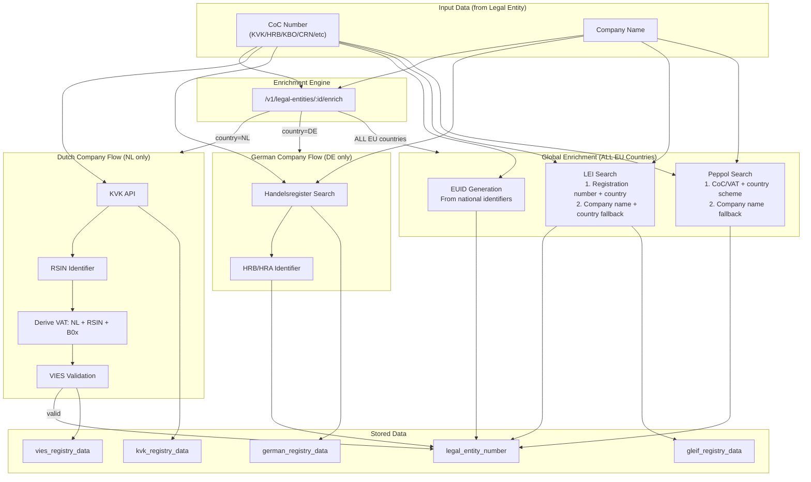
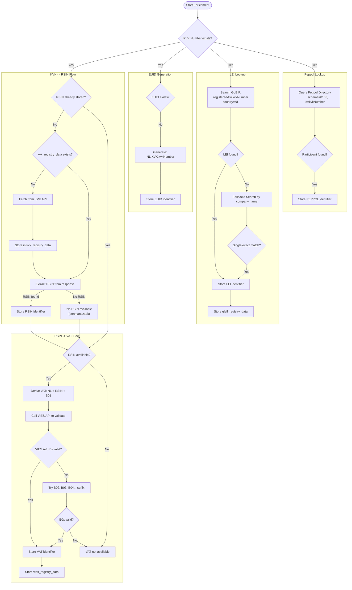
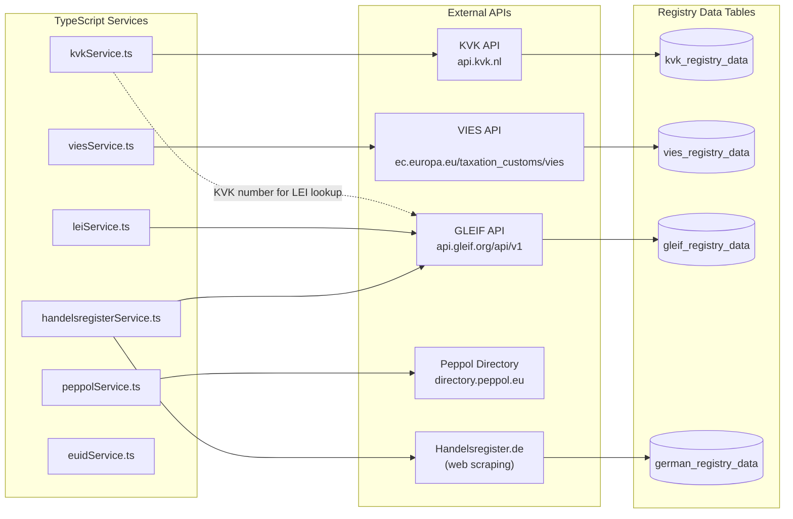
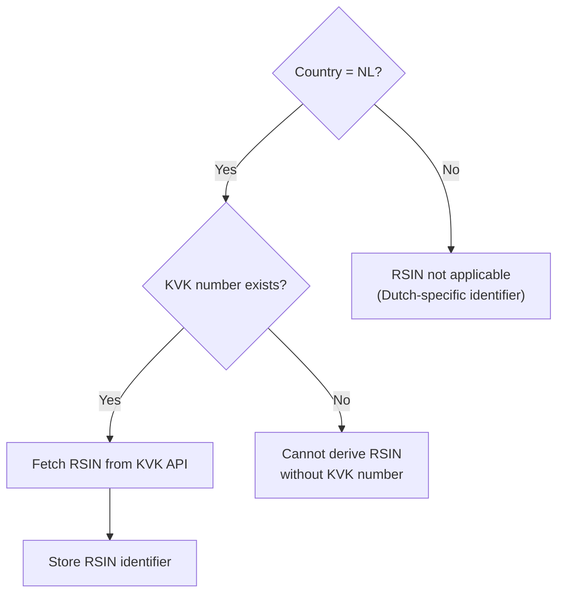
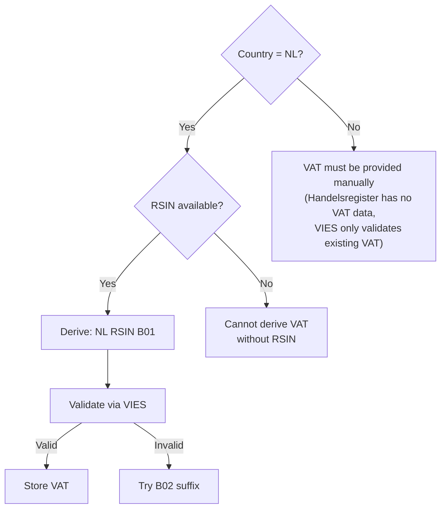

# Enrichment & Verification Architecture

**Last Updated:** 2025-12-17

This document visualizes the data enrichment and verification flows in the ASR system.

---

## Key Principles

1. **EUID, LEI, Peppol apply to ALL EU countries** - not just NL/DE
2. **Registration Number + Country first, then company name fallback** - LEI and Peppol search strategy
3. **Country-specific flows** - RSIN/VAT for NL, Handelsregister for DE
4. **Modular services** - Each enrichment type in its own service file for maintainability

---

## GLEIF API Search Strategy

**Critical:** The GLEIF API uses a specific search approach that must be followed exactly.

### Primary Search: Registration Number + Country

```
GET https://api.gleif.org/api/v1/lei-records
  ?filter[entity.registeredAs]={registrationNumber}
  &filter[entity.legalAddress.country]={countryCode}
```

**Parameters:**
- `filter[entity.registeredAs]` - Just the identifier number (e.g., `33031431`), NOT a combined format
- `filter[entity.legalAddress.country]` - Two-letter country code (e.g., `NL`, `DE`)

**Example for Dutch company:**
```
filter[entity.registeredAs]=33031431
filter[entity.legalAddress.country]=NL
```

### Fallback Search: Company Name (the official name as registered in for instance the KvK) + Country

If registration number lookup fails:

```
GET https://api.gleif.org/api/v1/lei-records
  ?filter[entity.legalName]={companyName}*
  &filter[entity.legalAddress.country]={countryCode}
  &page[size]=20
```

**Name Matching Logic:**
1. Single result -> Use it
2. Multiple results -> Try exact match (normalized, alphanumeric only)
3. No exact match -> Try starts-with match
4. No match -> Return not_found

### Important Notes

- **DO NOT** use combined formats like `NL-KVK/12345678` in registeredAs
- **DO NOT** try to filter by Registration Authority ID (RA code) in combination with registeredAs
- Germany has ~100 local court RA codes, making country filter more reliable than RA filtering
- The `registeredAt.id` field in GLEIF responses contains the RA code (e.g., `RA000463` for NL-KVK)

---

## High-Level Overview

The enrichment flow starts with a Legal Entity that has a **CoC Number** (Chamber of Commerce identifier like KVK, HRB, KBO, etc.) and/or **Company Name**. These inputs feed into the enrichment engine which then branches based on country code:



---

## Dutch Company Enrichment Flow (NL)

**RSIN Availability:** RSIN (Rechtspersonen en Samenwerkingsverbanden Informatienummer) is only available for legal entities that are registered as a "rechtspersoon" (legal person) in the Dutch system. **Eenmanszaken (sole proprietorships)** do not have an RSIN because they are not separate legal entities—the business and the owner are legally the same person. For these businesses, only the KVK number is available, and VAT cannot be auto-derived.



---

## German Company Enrichment Flow (DE)

**VAT for German Companies:** VAT numbers must be provided manually for German companies. The Handelsregister does not contain VAT data, and the VIES API can only validate existing VAT numbers—it cannot derive them. This is a fundamental difference from Dutch companies where VAT can be derived from RSIN.


---

## External Registry Services



---

## Identifier Type Matrix

### Country-Specific Identifiers

| Country | Identifier | Source | Derivation Logic |
|---------|------------|--------|------------------|
| NL | KVK | Input | Manual entry or application |
| NL | RSIN | KVK API | Extracted from `_embedded.eigenaar.rsin` |
| NL | VAT | Derived | `NL` + `RSIN` + `B01` (or B02, B03, B04, etc. for fiscal units) |
| NL | EUID | Generated | `NL.KVK.{kvkNumber}` |
| DE | HRB/HRA | Handelsregister | Scraped or manual entry |
| DE | EUID | Generated | `DE{courtCode}.{type}{number}` |
| DE | VAT | Manual | Cannot be auto-derived (Handelsregister has no VAT) |
| BE | KBO/BCE | Input | Belgian business register number |
| FR | SIRET/RCS | Input | French business register number |
| GB | CRN | Input | UK Companies House number |

### Global Identifiers (ALL EU Countries)

| Identifier | Source | Lookup Strategy |
|------------|--------|-----------------|
| **EUID** | Generated | From national identifier (KVK, KBO, HRB, SIREN, etc.) |
| **LEI** | GLEIF | 1. Registration number + country code<br>2. Company name + country fallback |
| **PEPPOL** | Peppol Directory | 1. CoC/VAT by country-specific scheme<br>2. Company name + country search fallback |

### EUID Format by Country

EUID (European Unique Identifier) is available for **ALL EU member states** via the BRIS system.

| Country | Format | Example | Source Identifier |
|---------|--------|---------|-------------------|
| NL | `NL.KVK.{number}` | `NL.KVK.12345678` | KVK |
| BE | `BE.KBO.{number}` | `BE.KBO.0123456789` | KBO/BCE |
| DE | `DE{courtCode}.{type}{number}` | `DEK1101R.HRB116737` | HRB/HRA + court code |
| FR | `FR.SIREN.{number}` | `FR.SIREN.123456789` | SIREN/SIRET |
| AT | `AT.FB.{number}` | `AT.FB.123456A` | FB (Firmenbuch) |
| IT | `IT.REA.{number}` | `IT.REA.RM-123456` | REA |
| ES | `ES.CIF.{number}` | `ES.CIF.A12345678` | CIF |
| DK | `DK.CVR.{number}` | `DK.CVR.12345678` | CVR |
| PL | `PL.KRS.{number}` | `PL.KRS.0000123456` | KRS |
| CH | `CH.CHR.{number}` | `CH.CHR.123456789` | CHR/UID |
| LU | `LU.RCS.{number}` | `LU.RCS.B123456` | RCS |
| PT | `PT.NIF.{number}` | `PT.NIF.123456789` | NIF |
| IE | `IE.CRO.{number}` | `IE.CRO.123456` | CRO |
| SE | `SE.ORG.{number}` | `SE.ORG.1234567890` | ORG |
| FI | `FI.YTJ.{number}` | `FI.YTJ.12345671` | YTJ/BID |
| CZ | `CZ.ICO.{number}` | `CZ.ICO.12345678` | ICO |

### Supported CoC Types for LEI Lookup

| Type | Country | GLEIF Registration Authority |
|------|---------|------------------------------|
| KVK | NL | RA000463 (Kamer van Koophandel) |
| HRB/HRA | DE | RA000197-RA000296 (~100 local courts) |
| KBO/BCE | BE | RA000025 (Kruispuntbank) |
| RCS/SIREN | FR | RA000192, RA000189 (Infogreffe, SIRENE) |
| CRN | GB | RA000585-RA000587 (Companies House) |
| REA | IT | RA000407 (Registro Delle Imprese) |
| CIF | ES | RA000533, RA000780 (Registro Mercantil) |
| CVR | DK | RA000170 (Central Business Register) |
| CHR | CH | RA000549, RA000548 (Handelsregister) |
| KRS | PL | RA000484 (Krajowy Rejestr Sadowy) |
| FB | AT | RA000017 (Firmenbuch) |

### Supported Identifiers for Peppol Lookup

| Type | Country | Peppol Scheme |
|------|---------|---------------|
| KVK | NL | 0106 |
| VAT | NL | 9944 |
| KBO | BE | 0208 |
| VAT | BE | 9925 |
| SIRET | FR | 0009 |
| CRN | GB | 0088 |
| CVR | DK | 0184 |
| VAT | DE | 9930 |

---

## EUID Format Examples

| Country | Format | Example |
|---------|--------|---------|
| Netherlands | `NL.KVK.{number}` | `NL.KVK.12345678` |
| Germany | `DE{courtCode}.{type}{number}` | `DED4601R.HRB15884` |
| Germany | `DEK1101R.{type}{number}` | `DEK1101R.HRB116737` (Hamburg) |
| Germany | `DER2210R.{type}{number}` | `DER2210R.HRB20885` (Koblenz) |

**German Court Codes:**
- D4601R = Amtsgericht Neuss
- K1101R = Amtsgericht Hamburg
- M1301R = Amtsgericht Munchen
- K1704R = Amtsgericht Duisburg
- R2210R = Amtsgericht Koblenz

---

## Decision Trees

### When is RSIN applicable?



### When can VAT be auto-derived?



### When can EUID be generated?


---

## Service Architecture

### Enrichment Services (Modular Design)

| Service | File | Purpose |
|---------|------|---------|
| **Orchestrator** | `api/src/services/enrichment/index.ts` | Main enrichment coordinator |
| **EUID Enrichment** | `api/src/services/enrichment/euidEnrichmentService.ts` | EUID generation (ALL EU countries) |
| **NL Enrichment** | `api/src/services/enrichment/nlEnrichmentService.ts` | Dutch: RSIN, VAT, KVK registry |
| **DE Enrichment** | `api/src/services/enrichment/deEnrichmentService.ts` | German: HRB/HRA, registry data |
| **LEI Enrichment** | `api/src/services/enrichment/leiEnrichmentService.ts` | GLEIF lookup (ALL countries) |
| **Peppol Enrichment** | `api/src/services/enrichment/peppolEnrichmentService.ts` | Peppol lookup (ALL countries) |
| **Types** | `api/src/services/enrichment/types.ts` | Shared TypeScript types |

### External API Services

| Service | File | Purpose |
|---------|------|---------|
| KVK | `api/src/services/kvkService.ts` | Dutch Chamber of Commerce API |
| VIES | `api/src/services/viesService.ts` | EU VAT validation |
| LEI | `api/src/services/leiService.ts` | GLEIF LEI lookup + storage |
| Handelsregister | `api/src/services/handelsregisterService.ts` | German commercial register |
| BundesAPI | `api/src/services/bundesApiService.ts` | Handelsregister.de scraping |
| Peppol | `api/src/services/peppolService.ts` | Peppol directory lookup |
| EUID | `api/src/services/euidService.ts` | EUID format generation |
| DNS | `api/src/services/dnsVerificationService.ts` | Domain ownership verification |

### Service Structure

```
api/src/services/
├── enrichment/                     # ENRICHMENT ORCHESTRATION
│   ├── index.ts                    # Main orchestrator - enrichLegalEntity()
│   ├── types.ts                    # EnrichmentContext, EnrichmentResult types
│   ├── euidEnrichmentService.ts    # enrichEuid() - ALL EU countries
│   ├── nlEnrichmentService.ts      # enrichRsin(), enrichVat() - NL only
│   ├── deEnrichmentService.ts      # enrichGermanRegistry() - DE only
│   ├── leiEnrichmentService.ts     # enrichLei() - ALL countries via CoC or name
│   └── peppolEnrichmentService.ts  # enrichPeppol() - ALL countries via CoC/VAT or name
├── kvkService.ts                   # KVK API client
├── viesService.ts                  # VIES API client
├── leiService.ts                   # GLEIF API client + storeGleifRegistryData()
├── handelsregisterService.ts       # Handelsregister search logic
├── bundesApiService.ts             # Handelsregister.de web scraping
├── peppolService.ts                # Peppol Directory API client
└── euidService.ts                  # EUID format generation (legacy)
```

### Enrichment Context

```typescript
interface EnrichmentContext {
  pool: Pool;                              // PostgreSQL connection pool
  legalEntityId: string;                   // UUID of entity being enriched
  companyName: string | null;              // Company name for fallback searches
  countryCode: string;                     // Two-letter country code
  existingIdentifiers: ExistingIdentifier[]; // Already stored identifiers
  existingTypes: Set<string>;              // Quick lookup of existing types
}

interface EnrichmentResult {
  identifier: string;                      // e.g., 'LEI', 'VAT', 'EUID'
  status: EnrichmentStatus;                // See Enrichment Status Values below
  value?: string;                          // The identifier value if found
  message?: string;                        // Human-readable status message
}

// Enrichment status maps to verification_status when storing
type EnrichmentStatus = 'added' | 'exists' | 'error' | 'not_available';
```

### Benefits of Modular Architecture

1. **Separation of concerns** - Each enrichment type in its own service
2. **Testability** - Services can be unit tested independently
3. **Readability** - ~100-200 lines per service vs 900+ lines inline
4. **Global scope** - EUID, LEI and Peppol work for ALL EU countries
5. **Extensibility** - Easy to add new country-specific identifier formats

---

## API Response Format

### Enrichment Endpoint

**POST** `/api/v1/legal-entities/:id/enrich`

**Response:**
```json
{
  "success": true,
  "added_count": 3,
  "company_details_updated": true,
  "updated_fields": ["primary_legal_name", "city", "address_line1"],
  "german_registry_fetched": false,
  "results": [
    { "identifier": "RSIN", "status": "added", "value": "123456789" },
    { "identifier": "VAT", "status": "added", "value": "NL123456789B01" },
    { "identifier": "EUID", "status": "added", "value": "NL.KVK.12345678" },
    { "identifier": "LEI", "status": "exists", "value": "724500Y6YT5CU09QUU37" },
    { "identifier": "PEPPOL", "status": "not_available", "message": "No Peppol participant found" }
  ],
  "summary": {
    "added": ["RSIN: 123456789", "VAT: NL123456789B01", "EUID: NL.KVK.12345678"],
    "already_exists": ["LEI"],
    "not_available": ["PEPPOL (No Peppol participant found)"],
    "errors": [],
    "company_fields_updated": ["primary_legal_name", "city", "address_line1"]
  }
}
```

---

## Status Values

### Enrichment Status (API Response)

When enrichment runs, each identifier returns one of these statuses:

| Enrichment Status | Meaning | Maps to Verification Status |
|-------------------|---------|----------------------------|
| `added` | New identifier found and stored | `VERIFIED` or `VALIDATED` |
| `exists` | Identifier already in database | (unchanged) |
| `not_available` | Identifier cannot be found/derived | (not stored) |
| `error` | API or processing error occurred | (not stored) |

### Verification Status (Database)

The `validation_status` field in `legal_entity_number` table uses these values:

| Status | Meaning | Set When |
|--------|---------|----------|
| `VERIFIED` | Confirmed via external API | LEI from GLEIF, VAT from VIES, RSIN from KVK |
| `VALIDATED` | Format validated, auto-generated | EUID generated from national identifier |
| `PENDING` | Awaiting verification | Manual entry, awaiting API check |
| `UNVERIFIED` | Manual entry, not yet checked | User-entered identifier |
| `INVALID` | Failed verification | VIES returned invalid, GLEIF not found |

### Status Mapping

| Source | Enrichment Status | Verification Status |
|--------|-------------------|---------------------|
| LEI from GLEIF API | `added` | `VERIFIED` |
| VAT from VIES API | `added` | `VERIFIED` |
| RSIN from KVK API | `added` | `VERIFIED` |
| EUID auto-generated | `added` | `VALIDATED` |
| Peppol from Directory | `added` | `VERIFIED` |
| Manual entry | N/A | `UNVERIFIED` or `PENDING` |

---

