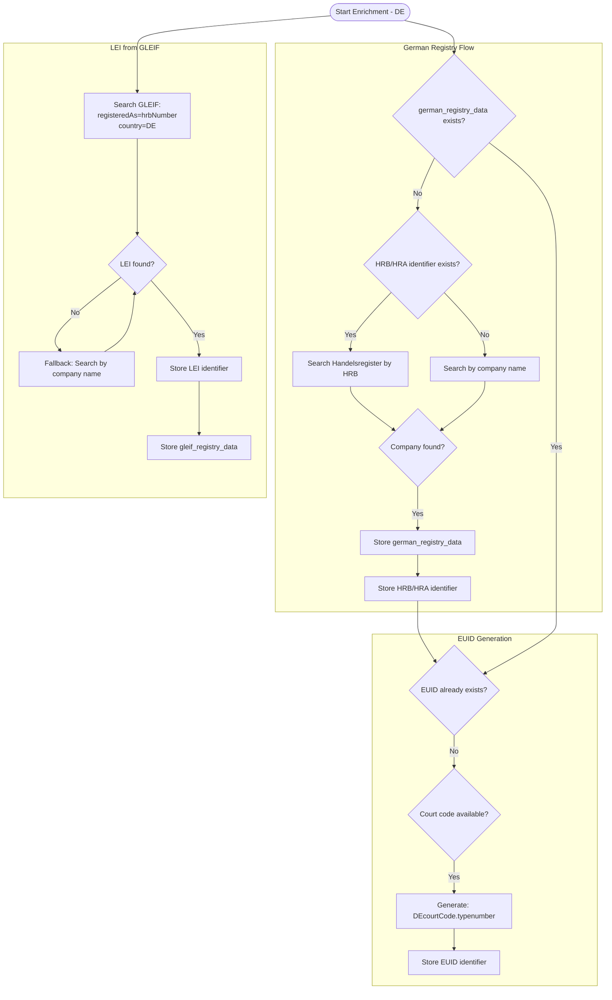
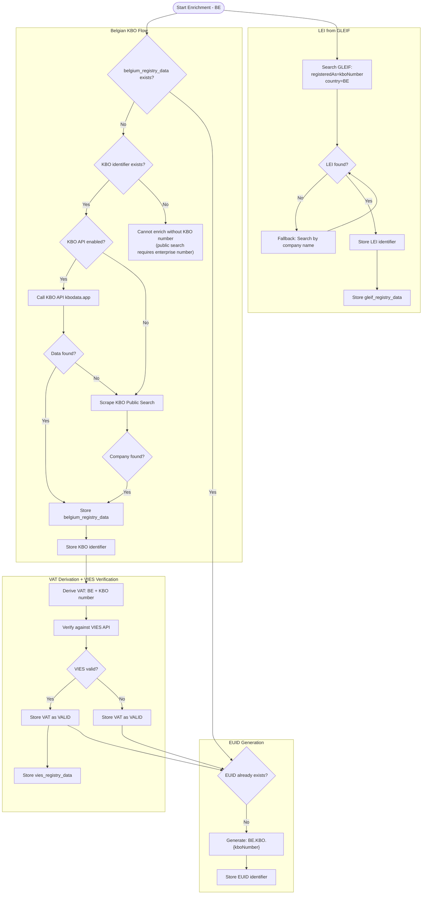
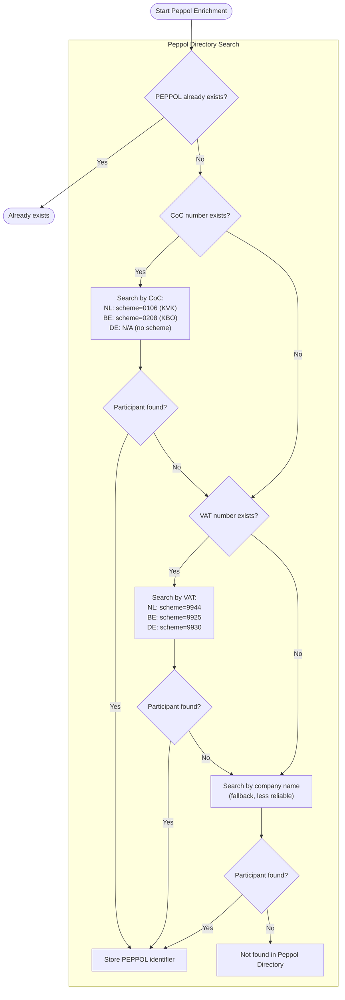
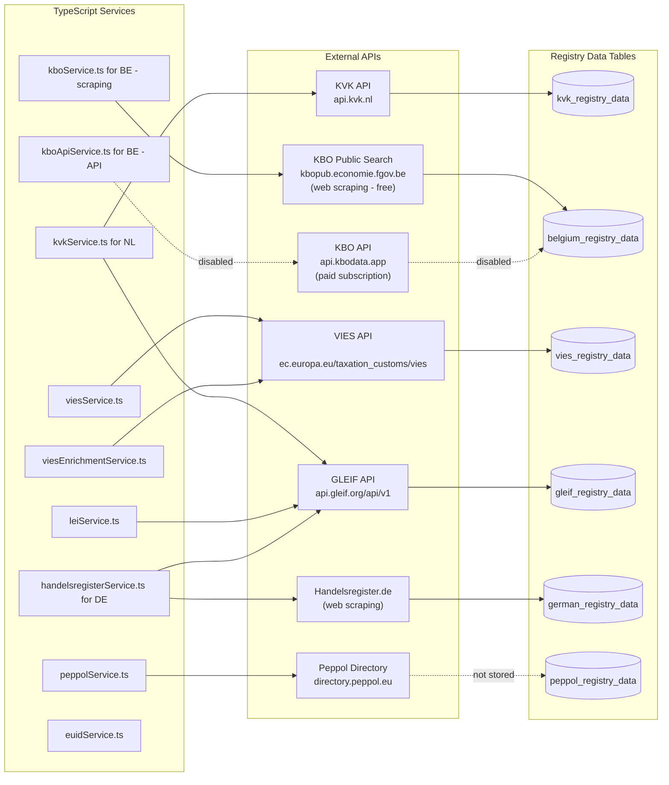
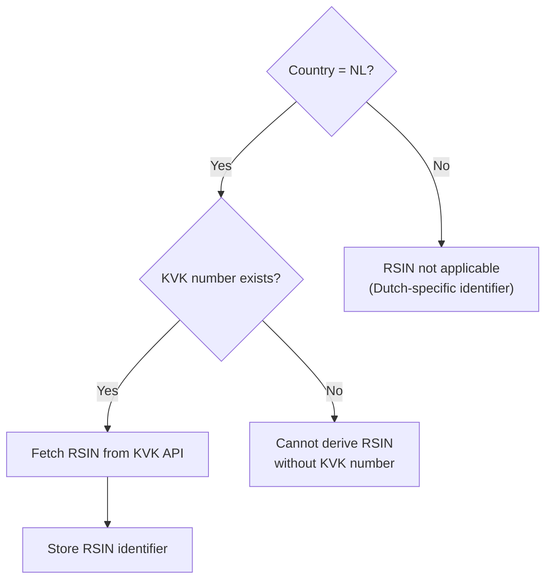
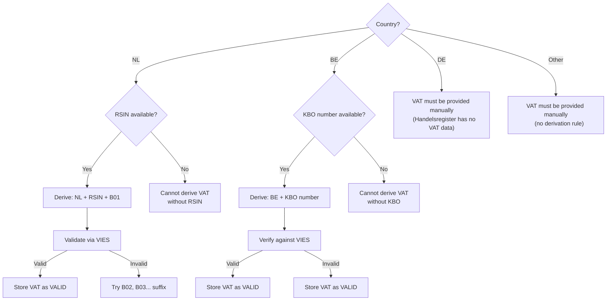

# Enrichment & Verification Architecture

**Last Updated:** 2025-12-17

This document describes and visualizes the data enrichment and verification flows in the ASR system.

---

## Key Principles

1. **EUID, LEI, Peppol apply to ALL EU countries** - not just NL/DE/BE
2. **Registration Number + Country first, then company name fallback** - LEI and Peppol search strategy
3. **Country-specific flows** - RSIN/VAT for NL, Handelsregister for DE, KBO for BE
4. **Modular services** - Each enrichment type in its own service file for maintainability

---

## GLEIF API Search Strategy

**Critical:** The GLEIF API uses a specific search approach that must be followed.

### Primary Search: Registration Number + Country

```
GET https://api.gleif.org/api/v1/lei-records
  ?filter[entity.registeredAs]={registrationNumber}
  &filter[entity.legalAddress.country]={countryCode}
```

**Parameters:**
- `filter[entity.registeredAs]` - Just the (CoC) identifier number (e.g., `33031431`)
- `filter[entity.legalAddress.country]` - Two-letter country code (e.g., `NL`, `DE`)

**Example for Dutch company:**

```
filter[entity.registeredAs]=33031431
filter[entity.legalAddress.country]=NL
```

### Fallback Search: Company Name (the official registered company name) + Country

If registration number lookup fails:

```
GET https://api.gleif.org/api/v1/lei-records
  ?filter[entity.legalName]={companyName}*
  &filter[entity.legalAddress.country]={countryCode}
  &page[size]=20
```

**Name Matching Logic:**
1. Single result -> Use it
2. Multiple results -> Try exact match (normalized, alphanumeric only)
3. No exact match -> Try starts-with match
4. No match -> Return not_found

### Important Notes

- **DO NOT** use combined formats like `NL-KVK/12345678` in `registeredAs`
- The GLEIF API does **NOT** support filtering by Registration Authority (RA) code - there is no `filter[registeredAt.id]` parameter
- Use `filter[entity.legalAddress.country]` instead of RA code filtering (works reliably for all countries including Germany with its ~100 local court RA codes)
- The GLEIF **response** contains `registeredAt.id` with the RA code (e.g., `RA000463` for NL-KVK) - we store this for reference, but cannot use it for searching

---

## Dutch Company Enrichment Flow (NL)

**RSIN Availability:** RSIN (Rechtspersonen en Samenwerkingsverbanden Informatienummer) is only available for legal entities that are registered as a "rechtspersoon" (legal person) in the Dutch system. **Eenmanszaken (sole proprietorships)** do not have an RSIN because they are not separate legal entities—the business and the owner are legally the same person. For these businesses, only the KVK number is available, and VAT cannot be auto-derived.


---

## German Company Enrichment Flow (DE)

**VAT for German Companies:** VAT numbers must be provided manually for German companies. The Handelsregister does not contain VAT data, and the VIES API can only validate existing VAT numbers—it cannot derive them. This is a fundamental difference from Dutch companies where VAT can be derived from RSIN.



---

## Belgian Company Enrichment Flow (BE)

**VAT for Belgian Companies:** Belgian VAT numbers are directly derived from the KBO (Kruispuntbank van Ondernemingen) number. The format is `BE` + the 10-digit KBO number (without dots). For example, KBO `0439.291.125` becomes VAT `BE0439291125`. This is much simpler than Dutch or German VAT derivation.

**Data Sources:**
- **KBO Public Search (free)**: Web scraping of `kbopub.economie.fgov.be` - Always available
- **KBO API (paid)**: Official API via `kbodata.app` - Richer data, requires subscription

The enrichment service tries KBO API first if enabled, then falls back to public scraping.



---

## Peppol Enrichment Flow (ALL EU Countries)

**Peppol** is a pan-European e-invoicing network. Companies registered in the Peppol Directory can send and receive electronic invoices. The enrichment service searches for Peppol participants using country-specific identifier schemes.

**Search Strategy:**
1. First, search by national registry number (KVK for NL, KBO for BE, etc.)
2. Then, search by VAT number
3. Fallback: search by company name (less reliable)



**Peppol Identifier Schemes by Country:**

| Country | CoC Scheme | VAT Scheme | Example |
|---------|-----------|-----------|---------|
| **NL** | 0106 (KVK) | 9944 | `0106:12345678` |
| **BE** | 0208 (KBO) | 9925 | `0208:0439291125` |
| **DE** | - | 9930 | `9930:DE123456789` |
| **FR** | 0009 (SIRET) | 9957 | `0009:12345678901234` |
| **GB** | 0088 (CRN) | 9932 | `0088:12345678` |
| **DK** | 0184 (CVR) | 9902 | `0184:12345678` |

**Document Types Supported:**
- UBL Invoice 2.1 (Peppol BIS Billing 3.0)
- UBL Credit Note 2.1
- CII CrossIndustryInvoice (D16B)
- Self-billing variants

---

## External Registry Services



**Notes:**
- The KBO API (kbodata.app) is currently disabled pending subscription. When enabled, it provides richer data including contacts, roles, and financial information.
- The `peppol_registry_data` table exists in the schema but is not currently used by the enrichment service. Only the PEPPOL identifier is stored in `legal_entity_number`. Future enhancement: store full Peppol API response for audit trail.

---

## Data Sources & Rate Limits

### Web Scraping Services

⚠️ **Important:** The following services use web scraping rather than official APIs. This means they have rate limits to avoid being blocked and may be more fragile than API-based services.

#### German Handelsregister (DE)

| Service | URL | Method | Rate Limit |
|---------|-----|--------|------------|
| **BundesAPI** | `handelsregister.de` | Web scraping | **60 requests/hour** (1 per minute) |
| **GLEIF** (fallback) | `api.gleif.org` | REST API | No hard limit (fair use) |

**Implementation:** `api/src/services/bundesApiService.ts`

```typescript
// Rate limit: 60 queries/hour per Terms of Use
private readonly minRequestInterval = 60000; // 1 minute between requests
```

**Notes:**
- The BundesAPI scrapes the official German commercial register at `handelsregister.de`
- Rate limiting is enforced via minimum delay between requests
- If rate limit is exceeded, the service will return an error
- GLEIF is used as a secondary source (only for companies with LEI)

#### Belgian KBO Public Search (BE)

| Service | URL | Method | Rate Limit |
|---------|-----|--------|------------|
| **KBO Public** | `kbopub.economie.fgov.be` | Web scraping | No documented limit (be respectful) |
| **KBO API** (paid) | `api.kbodata.app` | REST API | Per subscription tier |

**Implementation:** `api/src/services/kboService.ts`

```typescript
// No explicit rate limit implemented, but use responsibly
// For high-volume needs, use the paid KBO API instead
```

**Notes:**
- The KBO public search requires an enterprise number (KBO number) - name search is not supported
- Web scraping parses HTML responses from the Belgian government portal
- For production use with high volume, the paid KBO API is recommended
- The paid API provides richer data and guaranteed availability

### Official API Services

These services use official REST APIs with published rate limits:

| Service | API | Rate Limit | Auth Required |
|---------|-----|------------|---------------|
| **KVK** (NL) | `api.kvk.nl` | Per API key tier | Yes (API key) |
| **GLEIF** | `api.gleif.org` | Fair use policy | No |
| **VIES** | `ec.europa.eu/taxation_customs/vies` | Fair use policy | No |
| **Peppol Directory** | `directory.peppol.eu` | 2 req/second | No |

**Peppol Rate Limiting Implementation:** `api/src/services/peppolService.ts`

```typescript
// Rate limit: 2 queries per second (500ms minimum between requests)
const MIN_REQUEST_INTERVAL_MS = 500;
```

---

## Identifier Type Matrix

### Country-Specific Identifiers

| Country | Identifier | Source | Derivation Logic |
|---------|------------|--------|------------------|
| NL | KVK | Input | Manual entry or application |
| NL | RSIN | KVK API | Extracted from `_embedded.eigenaar.rsin` |
| NL | VAT | Generated | `NL` + `RSIN` + `B01` (or B02, B03, B04, etc. for fiscal units) |
| NL | EUID | Generated | `NL.KVK.{kvkNumber}` |
| DE | HRB/HRA | Handelsregister | Scraped or manual entry |
| DE | EUID | Generated | `DE{courtCode}.{type}{number}` |
| DE | VAT | Manual | Cannot be auto-derived (Handelsregister has no VAT) |
| BE | KBO/BCE | Input/KBO Public | Belgian business register number (10 digits) |
| BE | VAT | Generated | `BE` + KBO number (without dots) |
| BE | EUID | Generated | `BE.KBO.{kboNumber}` |
| FR | SIRET/RCS | Input | French business register number |
| GB | CRN | Input | UK Companies House number |

### Global Identifiers (ALL EU Countries)

| Identifier | Source | Lookup Strategy |
|------------|--------|-----------------|
| **EUID** | Generated | From national identifier (KVK, KBO, HRB, SIREN, etc.) |
| **LEI** | GLEIF | 1. Registration number + country code<br>2. Company name + country fallback |
| **PEPPOL** | Peppol Directory | 1. CoC/VAT by country-specific scheme<br>2. Company name + country search fallback |

### EUID Format by Country

EUID (European Unique Identifier) is available for **ALL EU member states** via the BRIS system.

| Country | Format | Example | Source Identifier |
|---------|--------|---------|-------------------|
| NL | `NL.KVK.{number}` | `NL.KVK.12345678` | KVK |
| BE | `BE.KBO.{number}` | `BE.KBO.0123456789` | KBO/BCE |
| DE | `DE{courtCode}.{type}{number}` | `DEK1101R.HRB116737` | HRB/HRA + court code |
| FR | `FR.SIREN.{number}` | `FR.SIREN.123456789` | SIREN/SIRET |
| AT | `AT.FB.{number}` | `AT.FB.123456A` | FB (Firmenbuch) |
| IT | `IT.REA.{number}` | `IT.REA.RM-123456` | REA |
| ES | `ES.CIF.{number}` | `ES.CIF.A12345678` | CIF |
| DK | `DK.CVR.{number}` | `DK.CVR.12345678` | CVR |
| PL | `PL.KRS.{number}` | `PL.KRS.0000123456` | KRS |
| CH | `CH.CHR.{number}` | `CH.CHR.123456789` | CHR/UID |
| LU | `LU.RCS.{number}` | `LU.RCS.B123456` | RCS |
| PT | `PT.NIF.{number}` | `PT.NIF.123456789` | NIF |
| IE | `IE.CRO.{number}` | `IE.CRO.123456` | CRO |
| SE | `SE.ORG.{number}` | `SE.ORG.1234567890` | ORG |
| FI | `FI.YTJ.{number}` | `FI.YTJ.12345671` | YTJ/BID |
| CZ | `CZ.ICO.{number}` | `CZ.ICO.12345678` | ICO |

### Supported CoC Types for LEI Lookup

| Type | Country | GLEIF Registration Authority |
|------|---------|------------------------------|
| KVK | NL | RA000463 (Kamer van Koophandel) |
| HRB/HRA | DE | RA000197-RA000296 (~100 local courts) |
| KBO/BCE | BE | RA000025 (Kruispuntbank) |
| RCS/SIREN | FR | RA000192, RA000189 (Infogreffe, SIRENE) |
| CRN | GB | RA000585-RA000587 (Companies House) |
| REA | IT | RA000407 (Registro Delle Imprese) |
| CIF | ES | RA000533, RA000780 (Registro Mercantil) |
| CVR | DK | RA000170 (Central Business Register) |
| CHR | CH | RA000549, RA000548 (Handelsregister) |
| KRS | PL | RA000484 (Krajowy Rejestr Sadowy) |
| FB | AT | RA000017 (Firmenbuch) |

### Supported Identifiers for Peppol Lookup

| Type | Country | Peppol Scheme |
|------|---------|---------------|
| KVK | NL | 0106 |
| VAT | NL | 9944 |
| KBO | BE | 0208 |
| VAT | BE | 9925 |
| SIRET | FR | 0009 |
| CRN | GB | 0088 |
| CVR | DK | 0184 |
| VAT | DE | 9930 |

---

## EUID Format Examples

| Country | Format | Example |
|---------|--------|---------|
| Netherlands | `NL.KVK.{number}` | `NL.KVK.12345678` |
| Germany | `DE{courtCode}.{type}{number}` | `DED4601R.HRB15884` |
| Germany | `DEK1101R.{type}{number}` | `DEK1101R.HRB116737` (Hamburg) |
| Germany | `DER2210R.{type}{number}` | `DER2210R.HRB20885` (Koblenz) |

**German Court Codes:**
- D4601R = Amtsgericht Neuss
- K1101R = Amtsgericht Hamburg
- M1301R = Amtsgericht Munchen
- K1704R = Amtsgericht Duisburg
- R2210R = Amtsgericht Koblenz

---

## Decision Trees

### When is RSIN applicable?



### When can VAT be auto-derived?



**VAT Derivation Rules by Country:**

| Country | Rule | Example |
|---------|------|---------|
| **NL** | `NL` + RSIN + `B01` (try B02, B03 if invalid) | `NL861785721B01` |
| **BE** | `BE` + KBO number (10 digits, no dots) | `BE0439291125` |
| **DE** | Manual entry only (Handelsregister has no VAT) | `DE123456789` |
| **Other** | Manual entry | Country-specific format |

### When can EUID be generated?


---

## Service Architecture

### Enrichment Services (Modular Design)

| Service | File | Purpose |
|---------|------|---------|
| **Orchestrator** | `api/src/services/enrichment/index.ts` | Main enrichment coordinator |
| **EUID Enrichment** | `api/src/services/enrichment/euidEnrichmentService.ts` | EUID generation (ALL EU countries) |
| **NL Enrichment** | `api/src/services/enrichment/nlEnrichmentService.ts` | Dutch: RSIN, VAT, KVK registry |
| **DE Enrichment** | `api/src/services/enrichment/deEnrichmentService.ts` | German: HRB/HRA, registry data |
| **BE Enrichment** | `api/src/services/enrichment/beEnrichmentService.ts` | Belgian: KBO, VAT derivation |
| **LEI Enrichment** | `api/src/services/enrichment/leiEnrichmentService.ts` | GLEIF lookup (ALL countries) |
| **Peppol Enrichment** | `api/src/services/enrichment/peppolEnrichmentService.ts` | Peppol lookup (ALL countries) |
| **VIES Enrichment** | `api/src/services/enrichment/viesEnrichmentService.ts` | Batch VAT verification against VIES |
| **Types** | `api/src/services/enrichment/types.ts` | Shared TypeScript types |

### External API Services

| Service | File | Purpose | Method | Status |
|---------|------|---------|--------|--------|
| KVK | `api/src/services/kvkService.ts` | Dutch Chamber of Commerce | REST API | Active |
| KBO (scraping) | `api/src/services/kboService.ts` | Belgian KBO public search | **Web Scraping** | Active |
| KBO API | `api/src/services/kboApiService.ts` | Belgian KBO official API (kbodata.app) | REST API | **Disabled** (requires subscription) |
| VIES | `api/src/services/viesService.ts` | EU VAT validation | SOAP/REST API | Active |
| LEI | `api/src/services/leiService.ts` | GLEIF LEI lookup + storage | REST API | Active |
| Handelsregister | `api/src/services/handelsregisterService.ts` | German commercial register coordinator | Mixed | Active |
| BundesAPI | `api/src/services/bundesApiService.ts` | Handelsregister.de | **Web Scraping** (60/hr limit) | Active |
| Peppol | `api/src/services/peppolService.ts` | Peppol directory lookup | REST API (2/sec limit) | Active |
| EUID | `api/src/services/euidService.ts` | EUID format generation | Local generation | Active |
| DNS | `api/src/services/dnsVerificationService.ts` | Domain ownership verification | DNS lookup | Active |

### KBO API (Belgium) - Paid Service

The Belgian KBO API service (`kboApiService.ts`) provides access to the official KBO database via `kbodata.app`.

**Current Status:** DISABLED (requires paid subscription)

**To Enable:**
1. Subscribe at https://kbodata.app
2. Get API key from dashboard
3. Set environment variable: `KBO_API_KEY=your_api_key`
4. Set `KBO_API_ENABLED=true` in `kboApiService.ts`

**Available Plans:**
- **Search**: Basic search functionality
- **Medium**: Includes NSSO/RSZ employee data
- **Large**: Full access including contacts, roles, financial data

**Endpoints Available:**
- `GET /enterprise/{number}` - Enterprise details
- `GET /enterprise/{number}/address` - Addresses
- `GET /enterprise/{number}/activities` - NACE codes
- `GET /enterprise/{number}/denominations` - Business names
- `GET /enterprise/{number}/establishments` - Branch offices
- `GET /enterprise/{number}/contact` - Contact info (Large plan)
- `GET /enterprise/{number}/roles` - Board members (Large plan)
- `GET /enterprise/{number}/financial` - Capital/fiscal year (Large plan)
- `GET /denominations?query=` - Search by name

### Service Structure

```
api/src/services/
├── enrichment/                     # ENRICHMENT ORCHESTRATION
│   ├── index.ts                    # Main orchestrator - enrichLegalEntity()
│   ├── types.ts                    # EnrichmentContext, EnrichmentResult types
│   ├── euidEnrichmentService.ts    # enrichEuid() - ALL EU countries
│   ├── nlEnrichmentService.ts      # enrichRsin(), enrichVat() - NL only
│   ├── deEnrichmentService.ts      # enrichGermanRegistry() - DE only
│   ├── beEnrichmentService.ts      # enrichBelgianRegistry() - BE only
│   ├── leiEnrichmentService.ts     # enrichLei() - ALL countries via CoC or name
│   ├── peppolEnrichmentService.ts  # enrichPeppol() - ALL countries via CoC/VAT or name
│   └── viesEnrichmentService.ts    # verifyVatAgainstVies(), batch verification
├── kvkService.ts                   # KVK API client (NL)
├── kboService.ts                   # KBO Public Search scraping (BE) - free
├── kboApiService.ts                # KBO API client (BE) - paid, DISABLED
├── viesService.ts                  # VIES API client
├── leiService.ts                   # GLEIF API client + storeGleifRegistryData()
├── handelsregisterService.ts       # Handelsregister search logic (DE)
├── bundesApiService.ts             # Handelsregister.de web scraping
├── peppolService.ts                # Peppol Directory API client
└── euidService.ts                  # EUID format generation (legacy)
```

### Enrichment Context

```typescript
interface EnrichmentContext {
  pool: Pool;                              // PostgreSQL connection pool
  legalEntityId: string;                   // UUID of entity being enriched
  companyName: string | null;              // Company name for fallback searches
  countryCode: string;                     // Two-letter country code
  existingIdentifiers: ExistingIdentifier[]; // Already stored identifiers
  existingTypes: Set<string>;              // Quick lookup of existing types
}

interface EnrichmentResult {
  identifier: string;                      // e.g., 'LEI', 'VAT', 'EUID'
  status: EnrichmentStatus;                // See Enrichment Status Values below
  value?: string;                          // The identifier value if found
  message?: string;                        // Human-readable status message
}

// Enrichment status maps to verification_status when storing
type EnrichmentStatus = 'added' | 'exists' | 'error' | 'not_available';
```

### Benefits of Modular Architecture

1. **Separation of concerns** - Each enrichment type in its own service
2. **Testability** - Services can be unit tested independently
3. **Readability** - ~100-200 lines per service vs 900+ lines inline
4. **Global scope** - EUID, LEI and Peppol work for ALL EU countries
5. **Extensibility** - Easy to add new country-specific identifier formats

---

## API Response Format

### Enrichment Endpoint

**POST** `/api/v1/legal-entities/:id/enrich`

**Response:**
```json
{
  "success": true,
  "added_count": 3,
  "company_details_updated": true,
  "updated_fields": ["primary_legal_name", "city", "address_line1"],
  "german_registry_fetched": false,
  "results": [
    { "identifier": "RSIN", "status": "added", "value": "123456789" },
    { "identifier": "VAT", "status": "added", "value": "NL123456789B01" },
    { "identifier": "EUID", "status": "added", "value": "NL.KVK.12345678" },
    { "identifier": "LEI", "status": "exists", "value": "724500Y6YT5CU09QUU37" },
    { "identifier": "PEPPOL", "status": "not_available", "message": "No Peppol participant found" }
  ],
  "summary": {
    "added": ["RSIN: 123456789", "VAT: NL123456789B01", "EUID: NL.KVK.12345678"],
    "already_exists": ["LEI"],
    "not_available": ["PEPPOL (No Peppol participant found)"],
    "errors": [],
    "company_fields_updated": ["primary_legal_name", "city", "address_line1"]
  }
}
```

---

## Status Values

### Enrichment Status (API Response)

When enrichment runs, each identifier returns one of these statuses:

| Enrichment Status | Meaning | Maps to Validation Status |
|-------------------|---------|---------------------------|
| `added` | New identifier found and stored | `VALID` |
| `exists` | Identifier already in database | (unchanged) |
| `not_available` | Identifier cannot be found/derived | (not stored) |
| `error` | API or processing error occurred | (not stored) |

### Validation Status (Database)

> **Terminology Update (December 2025):** The validation status values were updated to align with industry standards (GLEIF, KVK API, VIES). The previous terminology confused ACTIONS (verify, derive, validate) with RESULTS (valid, invalid).

The `validation_status` field in `legal_entity_number` table uses these values:

| Status | Meaning | Set When |
|--------|---------|----------|
| `VALID` | Confirmed valid by registry API or derivation rules | LEI from GLEIF, VAT from VIES, RSIN from KVK, EUID generated, Belgian VAT derived |
| `INVALID` | Registry confirmed identifier does not exist or failed validation | VIES returned invalid, GLEIF not found |
| `PENDING` | Not yet checked/verified | Manual entry, awaiting API check |
| `EXPIRED` | Was valid but verification has expired | Periodic re-verification needed |
| `NOT_VERIFIABLE` | Cannot be verified (no registry API exists) | Identifier types without registry APIs |

**Legacy Status Mapping (for reference):**
| Old Status | New Status | Reason |
|------------|------------|--------|
| `VERIFIED` | `VALID` | External API confirmed |
| `VALIDATED` | `VALID` | Format valid, auto-generated |
| `DERIVED` | `VALID` | Mathematically derived from valid source |
| `FAILED` | `INVALID` | Verification failed |
| `UNVERIFIED` | `PENDING` | Awaiting check |

### Status Mapping

| Source | Enrichment Status | Validation Status |
|--------|-------------------|-------------------|
| LEI from GLEIF API | `added` | `VALID` |
| VAT from VIES API | `added` | `VALID` |
| RSIN from KVK API | `added` | `VALID` |
| EUID auto-generated | `added` | `VALID` |
| Peppol from Directory | `added` | `VALID` |
| Belgian VAT (derived from KBO) | `added` | `VALID` |
| KBO from Belgian registry | `added` | `VALID` |
| HRB/HRA from German registry | `added` | `VALID` |
| Manual entry | N/A | `PENDING` |
| VIES validation failed | N/A | `INVALID` |

---

