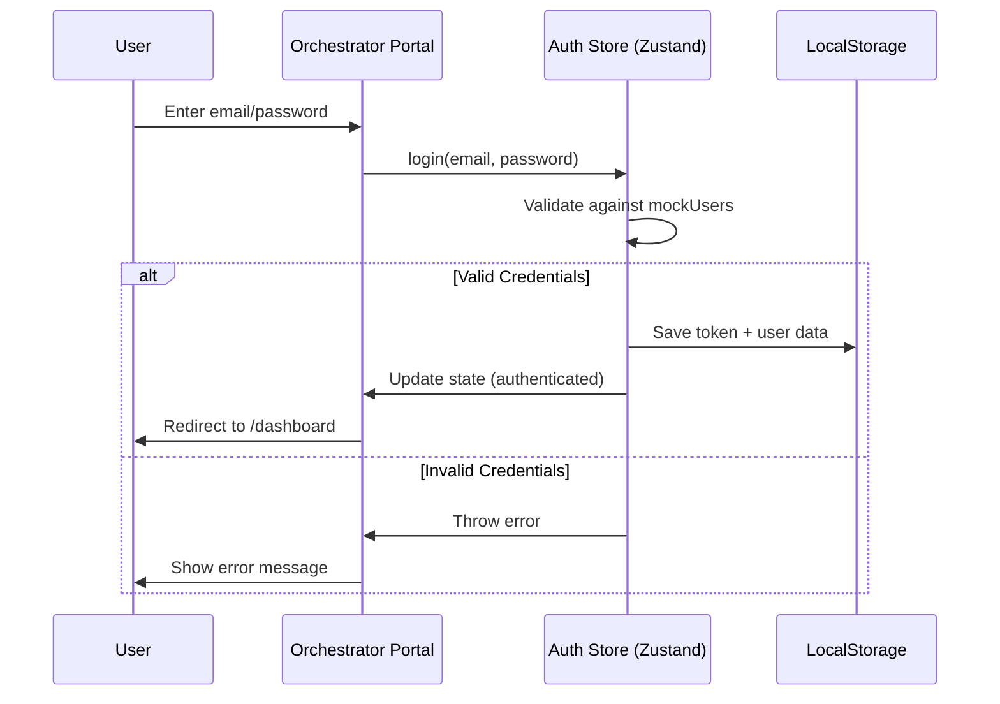
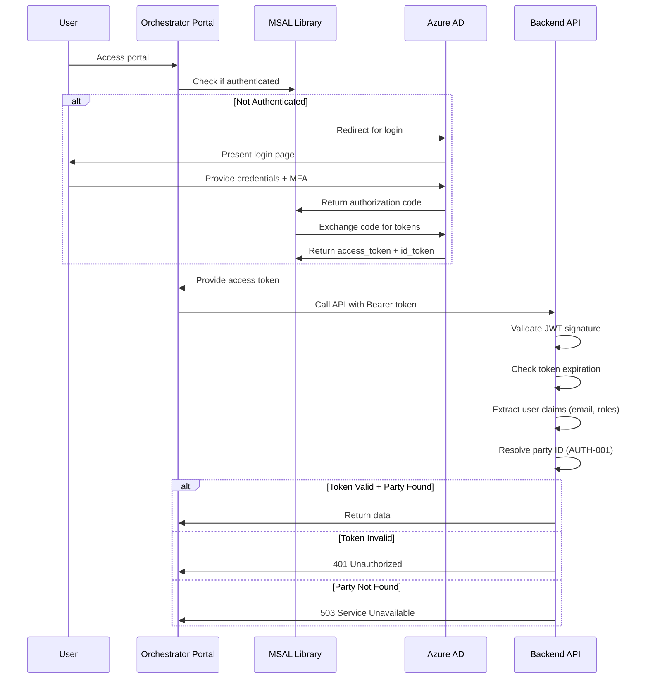
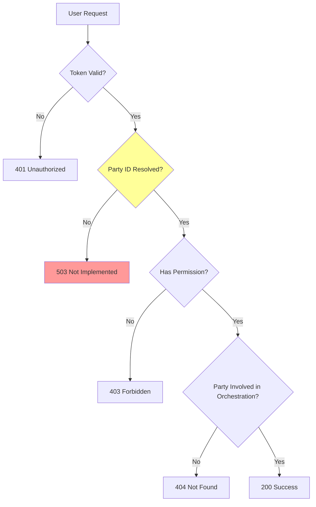
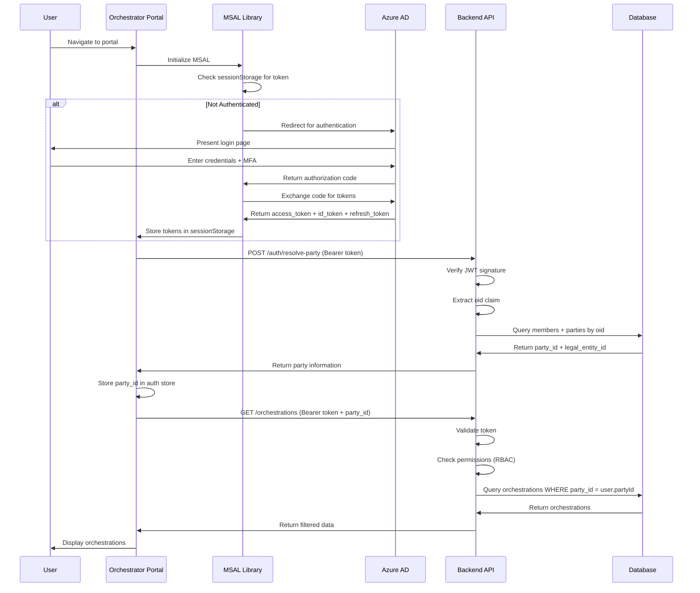
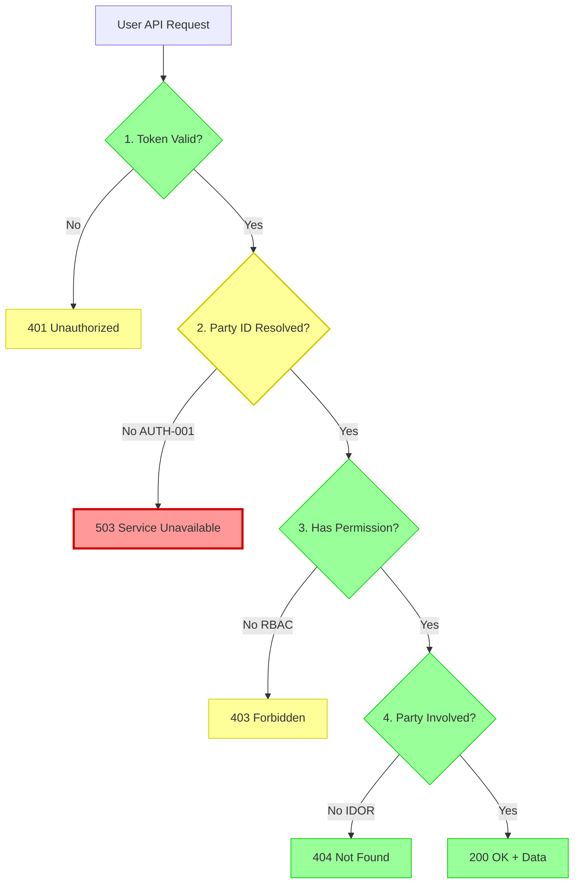
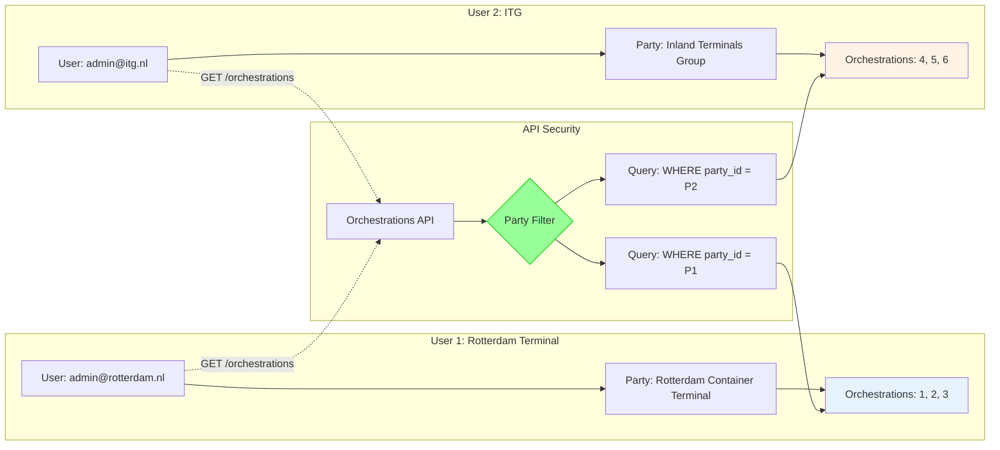

# Orchestrator Portal Security Documentation

**Last Updated:** October 19, 2025
**Status:** IN DEVELOPMENT - API NOT DEPLOYED
**Target Deployment:** Azure Static Web Apps
**Current URL:** https://blue-dune-0353f1303.1.azurestaticapps.net

---

## Table of Contents

1. [Overview](#overview)
2. [Authentication](#authentication)
3. [Authorization](#authorization)
4. [Security Headers](#security-headers)
5. [API Security](#api-security)
6. [Known Gaps & Production Blockers](#known-gaps--production-blockers)
7. [Security Best Practices](#security-best-practices)
8. [Production Readiness Checklist](#production-readiness-checklist)
9. [Threat Model](#threat-model)
10. [Compliance](#compliance)
11. [Architecture Diagrams](#architecture-diagrams)
12. [Security Configuration Reference](#security-configuration-reference)
13. [Recommendations](#recommendations)

---

## Overview

### Purpose

The **CTN Orchestrator Portal** provides real-time monitoring and management capabilities for container transport orchestrations within the CTN ecosystem. It is designed for orchestrator administrators who need visibility into shipment workflows, events, webhooks, and orchestration analytics.

### Target Users

- **Orchestrator Administrators** - Operations teams managing container transport orchestrations
- **Container Terminal Operators** - Monitor orchestrations involving their facilities
- **Logistics Coordinators** - Track shipment progress and event streams

### Security Model

The portal implements a **multi-layered security model**:

1. **Authentication** - Azure AD integration (planned, currently mock auth)
2. **Authorization** - Role-based access control (RBAC) with party-based data isolation
3. **Transport Security** - HTTPS/TLS enforced via HSTS
4. **Content Security** - CSP headers to prevent XSS attacks
5. **API Security** - Bearer token authentication with party verification

### Current Deployment Status

| Environment | Status | URL | Authentication |
|------------|--------|-----|----------------|
| **Development** | ✅ Active | http://localhost:5173 | Mock auth |
| **Azure (Staging)** | ⚠️ Deployed | https://blue-dune-0353f1303.1.azurestaticapps.net | Mock auth |
| **Production** | ❌ Blocked | N/A | Requires AUTH-001 fix |

**Production Blocker:** Missing party ID resolution (AUTH-001) prevents secure multi-tenant operation.

---

## Authentication

### Current Implementation (Development)

The portal currently uses **mock authentication** for development and testing purposes.

#### Mock Authentication Flow



#### Mock User Database

Located in `src/stores/authStore.ts`:

```typescript
const mockUsers: Record<string, User> = {
  "itg@example.com": {
    id: "user-1",
    name: "John Doe",
    email: "itg@example.com",
    tenantId: "itg-001",
    role: "admin"
  },
  "rotterdam@example.com": {
    id: "user-2",
    name: "Jane Smith",
    email: "rotterdam@example.com",
    tenantId: "rotterdam-terminal-001",
    role: "orchestrator"
  }
};
```

**Security Warning:** Mock authentication provides **NO SECURITY**. It:
- Accepts hardcoded credentials (password: "password")
- Stores tokens in localStorage (base64-encoded user object)
- Has no token expiration
- Cannot verify user identity
- Cannot revoke access

**This must be replaced before production deployment.**

### Planned Implementation (Production)

#### Azure AD Integration (MSAL)

The production system will use **Microsoft Authentication Library (MSAL)** for Azure AD integration.

**Required Configuration:**

```typescript
// src/config/authConfig.ts (to be created)
import { Configuration } from '@azure/msal-browser';

export const msalConfig: Configuration = {
  auth: {
    clientId: process.env.VITE_AZURE_CLIENT_ID!,
    authority: `https://login.microsoftonline.com/${process.env.VITE_AZURE_TENANT_ID}`,
    redirectUri: process.env.VITE_REDIRECT_URI || window.location.origin,
  },
  cache: {
    cacheLocation: 'sessionStorage', // Use sessionStorage for security
    storeAuthStateInCookie: false,
  },
};

export const loginRequest = {
  scopes: [`api://${process.env.VITE_AZURE_CLIENT_ID}/.default`],
};
```

#### Azure AD Authentication Flow



#### Token Claims

**ID Token Claims (user identity):**
```json
{
  "oid": "00000000-0000-0000-0000-000000000000",
  "email": "admin@rotterdam-terminal.nl",
  "name": "Jane Smith",
  "preferred_username": "admin@rotterdam-terminal.nl",
  "roles": ["OrchestratorAdmin"]
}
```

**Access Token Claims (API authorization):**
```json
{
  "aud": "api://func-ctn-demo-asr-dev",
  "iss": "https://login.microsoftonline.com/{tenant-id}/v2.0",
  "exp": 1729357200,
  "scp": "user_impersonation",
  "roles": ["OrchestratorAdmin"]
}
```

#### Session Management

**Token Lifecycle:**
- **Access Token:** 1 hour expiration
- **Refresh Token:** 90 days (if enabled)
- **ID Token:** 1 hour expiration

**Session Security:**
- Store tokens in `sessionStorage` (not `localStorage`)
- Clear tokens on browser close
- Implement silent token renewal
- Force re-authentication after 8 hours

**Implementation Pattern:**

```typescript
// Token refresh before expiration
const acquireTokenSilently = async () => {
  try {
    const response = await msalInstance.acquireTokenSilent({
      scopes: loginRequest.scopes,
      account: msalInstance.getAllAccounts()[0],
    });
    return response.accessToken;
  } catch (error) {
    // Silent refresh failed, force interactive login
    await msalInstance.acquireTokenRedirect(loginRequest);
  }
};
```

---

## Authorization

### RBAC Model

The Orchestrator Portal uses the same RBAC model as the main ASR system, defined in `api/src/middleware/rbac.ts`.

#### Relevant Roles

| Role | Description | Orchestration Permissions |
|------|-------------|--------------------------|
| **SystemAdmin** | Full system access | Read + Manage all orchestrations |
| **AssociationAdmin** | CTN administrative access | Read + Manage all orchestrations |
| **MemberAdmin** | Organization administrator | Read + Manage own orchestrations |
| **MemberUser** | Regular member user | Read own orchestrations |
| **MemberReadOnly** | Read-only access | Read own orchestrations |

#### Permission Mapping

```typescript
export enum Permission {
  READ_ORCHESTRATIONS = 'read:orchestrations',
  MANAGE_ORCHESTRATIONS = 'manage:orchestrations',
}

const ROLE_PERMISSIONS: Record<UserRole, Permission[]> = {
  [UserRole.SYSTEM_ADMIN]: [
    Permission.READ_ORCHESTRATIONS,
    Permission.MANAGE_ORCHESTRATIONS,
  ],
  [UserRole.ASSOCIATION_ADMIN]: [
    Permission.READ_ORCHESTRATIONS,
    Permission.MANAGE_ORCHESTRATIONS,
  ],
  [UserRole.MEMBER_ADMIN]: [
    Permission.READ_ORCHESTRATIONS,
    Permission.MANAGE_ORCHESTRATIONS,
  ],
  [UserRole.MEMBER_USER]: [
    Permission.READ_ORCHESTRATIONS,
  ],
  [UserRole.MEMBER_READONLY]: [
    Permission.READ_ORCHESTRATIONS,
  ],
};
```

### Party-Based Data Isolation

**Critical Security Principle:** Users can only access orchestrations where their party is involved.

#### Current Limitation (AUTH-001)

The portal currently **lacks party ID resolution**, which is the **primary production blocker**.

**Problem:**
```typescript
// Mock auth provides tenantId but not partyId
const user = {
  id: "user-1",
  email: "admin@rotterdam.nl",
  tenantId: "rotterdam-terminal-001", // ❌ Not the same as party_id
  role: "admin"
};

// API needs party_id to enforce data isolation
// Backend query: WHERE party_id IN (user's parties)
```

**Solution Required:**
```typescript
// POST /api/v1/auth/resolve-party
{
  "email": "admin@rotterdam.nl"
}

// Response:
{
  "party_id": "uuid-of-rotterdam-terminal-party",
  "party_name": "Rotterdam Container Terminal B.V.",
  "legal_entity_id": "uuid-of-legal-entity"
}
```

#### Authorization Flow (Current vs. Required)



**Status:**
- ✅ Token validation implemented (Azure AD JWT validation)
- ❌ Party ID resolution NOT implemented (AUTH-001)
- ✅ Permission checks implemented (RBAC middleware)
- ✅ Party involvement checks implemented (Gremlin queries)

### API Authorization Pattern

Example from `api/src/functions/GetOrchestrations.ts`:

```typescript
app.http('GetOrchestrations', {
  authLevel: 'anonymous',
  methods: ['GET'],
  route: 'orchestrations',
  handler: async (request: HttpRequest, context: InvocationContext) => {
    // 1. Authentication
    const authenticatedRequest = await authenticateRequest(request, context);
    if (!authenticatedRequest.user) {
      return { status: 401, jsonBody: { error: 'Unauthorized' } };
    }

    // 2. Authorization (Role check)
    const rbacCheck = requirePermissions([Permission.READ_ORCHESTRATIONS]);
    const authResult = rbacCheck(authenticatedRequest, context);
    if (!authResult.authorized) {
      return authResult.response;
    }

    // 3. Party ID Resolution (AUTH-001 - NOT IMPLEMENTED)
    const partyId = authenticatedRequest.user.partyId; // ❌ Currently undefined
    if (!partyId) {
      return {
        status: 503,
        jsonBody: { error: 'Party ID resolution not implemented' }
      };
    }

    // 4. Data Isolation (Party-based filtering)
    const orchestrations = await getOrchestrationsForParty(
      partyId,
      statusFilter,
      skip,
      limit
    );

    return { status: 200, jsonBody: orchestrations };
  }
});
```

---

## Security Headers

### Content Security Policy (CSP)

**Configuration:** `staticwebapp.config.json`

```json
{
  "globalHeaders": {
    "Content-Security-Policy": "default-src 'self'; script-src 'self'; style-src 'self' https://unpkg.com; img-src 'self' data: https:; font-src 'self' data: https://unpkg.com; connect-src 'self' https://func-ctn-demo-asr-dev.azurewebsites.net; frame-ancestors 'none'"
  }
}
```

#### CSP Directives Explained

| Directive | Value | Purpose | Risk Mitigation |
|-----------|-------|---------|-----------------|
| `default-src` | `'self'` | Default policy for all resources | Prevents loading external resources |
| `script-src` | `'self'` | Only allow scripts from same origin | Prevents XSS via inline scripts |
| `style-src` | `'self' https://unpkg.com` | Allow Kendo UI styles from unpkg CDN | Permits Kendo theme CSS |
| `img-src` | `'self' data: https:` | Allow images from same origin, data URIs, HTTPS | Supports base64 images + external HTTPS |
| `font-src` | `'self' data: https://unpkg.com` | Allow fonts from same origin + unpkg CDN | Kendo UI font icons |
| `connect-src` | `'self' https://func-ctn-demo-asr-dev.azurewebsites.net` | Allow API calls to backend | Whitelist API endpoint |
| `frame-ancestors` | `'none'` | Prevent embedding in iframes | Clickjacking protection |

#### CSP Status

| Feature | Status | Notes |
|---------|--------|-------|
| ✅ No `'unsafe-inline'` for scripts | Hardened | All scripts bundled by Vite |
| ✅ No `'unsafe-inline'` for styles | Hardened | Styles compiled to CSS files |
| ⚠️ `'unsafe-eval'` | **NOT PRESENT** | No eval() usage detected |
| ✅ `frame-ancestors 'none'` | Hardened | Clickjacking protection |
| ⚠️ External CDN dependency | Low Risk | unpkg.com for Kendo UI only |

**Improvement Opportunity:**
- Consider self-hosting Kendo UI assets to remove external CDN dependency
- Current CSP is production-ready as-is

### Strict-Transport-Security (HSTS)

```json
{
  "Strict-Transport-Security": "max-age=31536000; includeSubDomains; preload"
}
```

**Configuration:**
- **Max-Age:** 1 year (31536000 seconds)
- **includeSubDomains:** Applies to all subdomains
- **preload:** Eligible for browser HSTS preload lists

**Protection:** Forces HTTPS connections, prevents protocol downgrade attacks.

### Additional Security Headers

```json
{
  "X-Content-Type-Options": "nosniff",
  "X-Frame-Options": "DENY",
  "X-XSS-Protection": "1; mode=block",
  "Referrer-Policy": "strict-origin-when-cross-origin",
  "Permissions-Policy": "camera=(), microphone=(), geolocation=()"
}
```

| Header | Value | Protection |
|--------|-------|------------|
| `X-Content-Type-Options` | `nosniff` | Prevents MIME-type sniffing attacks |
| `X-Frame-Options` | `DENY` | Prevents clickjacking (iframe embedding) |
| `X-XSS-Protection` | `1; mode=block` | Legacy XSS filter (modern browsers use CSP) |
| `Referrer-Policy` | `strict-origin-when-cross-origin` | Limits referrer information leakage |
| `Permissions-Policy` | camera/mic/geo disabled | Prevents abuse of browser APIs |

**Status:** ✅ All security headers correctly configured for production.

---

## API Security

### Backend API Endpoint

**Development:** http://localhost:3001/api/v1 (mock API)
**Production:** https://func-ctn-demo-asr-dev.azurewebsites.net/api/v1

### Bearer Token Authentication

All API requests include JWT bearer tokens in the `Authorization` header.

**Request Pattern:**

```typescript
// src/services/orchestrations.ts
import axios from 'axios';
import { API_BASE_URL } from '../config/api';

export const orchestrationsApi = {
  getAll: async (params) => {
    const response = await axios.get(
      `${API_BASE_URL}/orchestrations`,
      {
        headers: {
          Authorization: `Bearer ${getAccessToken()}`, // JWT from MSAL
        },
        params: {
          tenantId: params?.tenantId,
          status: params?.status,
          search: params?.search,
        },
      }
    );
    return response.data;
  },
};
```

### Token Validation (Backend)

**Implementation:** `api/src/middleware/auth.ts`

```typescript
// JWT validation flow
1. Extract Bearer token from Authorization header
2. Verify JWT signature using Azure AD public keys (JWKS)
3. Check token expiration (exp claim)
4. Verify audience (aud claim matches API app ID)
5. Verify issuer (iss claim from correct Azure AD tenant)
6. Extract user claims (email, oid, roles)
7. Resolve party ID from database (AUTH-001 - NOT IMPLEMENTED)
```

**Security Checks:**
- ✅ JWT signature validation (RS256 algorithm)
- ✅ Token expiration check
- ✅ Audience validation
- ✅ Issuer validation
- ❌ Party ID resolution (AUTH-001)

### CORS Configuration

**Current Configuration:** Not documented (Azure Static Web Apps default)

**Required Production Configuration:**

```json
{
  "routes": [
    {
      "route": "/api/*",
      "allowedOrigins": [
        "https://blue-dune-0353f1303.1.azurestaticapps.net"
      ]
    }
  ]
}
```

**Recommendations:**
- Whitelist only the production portal URL
- Do NOT use wildcard `*` origins
- Include credentials: true for cookie-based sessions (if used)

### Rate Limiting

**Status:** ❌ Not Implemented

**Risk:** API abuse, DDoS attacks, credential stuffing.

**Recommendation:**

Implement rate limiting at Azure API Management or Application Gateway level:

```yaml
# Example: Azure API Management policy
<rate-limit calls="100" renewal-period="60" />
<quota calls="10000" renewal-period="86400" />
```

**Suggested Limits:**
- **Authenticated users:** 100 requests/minute per user
- **Unauthenticated:** 10 requests/minute per IP
- **Daily quota:** 10,000 requests per user

---

## Known Gaps & Production Blockers

### CRITICAL: AUTH-001 - Missing Party ID Resolution

**Issue ID:** AUTH-001
**Severity:** CRITICAL (Production Blocker)
**Status:** ❌ Not Implemented

#### What It Is

Party ID resolution is the process of mapping an authenticated Azure AD user to a `party_id` in the ASR database. This mapping is required for multi-tenant data isolation.

**Database Schema:**

```sql
-- parties table
CREATE TABLE parties (
  id UUID PRIMARY KEY,
  party_name VARCHAR(255) NOT NULL,
  legal_entity_id UUID REFERENCES legal_entities(id)
);

-- members table (links users to parties)
CREATE TABLE members (
  id UUID PRIMARY KEY,
  azure_ad_object_id UUID NOT NULL, -- oid claim from JWT
  email VARCHAR(255) NOT NULL,
  legal_entity_id UUID REFERENCES legal_entities(id),
  role VARCHAR(50)
);
```

#### Why It's Needed

**Without party ID resolution:**
- ✅ User can authenticate (Azure AD login works)
- ✅ User can access portal UI
- ❌ User CANNOT access any orchestration data
- ❌ API returns 503 "Party ID not resolved"
- ❌ Multi-tenant data isolation DOES NOT WORK

**With party ID resolution:**
- ✅ Map `oid` claim → `members.azure_ad_object_id` → `legal_entity_id` → `party_id`
- ✅ Filter orchestrations: `WHERE party_id IN (user's parties)`
- ✅ Enforce data isolation between terminals/logistics companies
- ✅ Prevent IDOR vulnerabilities (see LESSONS_LEARNED.md #16)

#### Impact of Not Having It

| Area | Impact |
|------|--------|
| **Functionality** | Portal displays "Service Unavailable" for all data requests |
| **Security** | Cannot enforce multi-tenant isolation |
| **User Experience** | Users see empty screens despite having data |
| **Production Readiness** | **BLOCKS production deployment** |

#### Implementation Requirements

**Step 1: Create Party Resolution Endpoint**

```typescript
// api/src/functions/ResolveParty.ts
app.http('ResolveParty', {
  authLevel: 'anonymous',
  methods: ['POST'],
  route: 'auth/resolve-party',
  handler: async (request: HttpRequest, context: InvocationContext) => {
    // Extract Azure AD oid from JWT
    const token = extractBearerToken(request);
    const claims = verifyJWT(token);
    const oid = claims.oid;

    // Query database for party association
    const query = `
      SELECT p.id as party_id, p.party_name, m.legal_entity_id
      FROM members m
      JOIN legal_entities le ON m.legal_entity_id = le.id
      JOIN parties p ON le.id = p.legal_entity_id
      WHERE m.azure_ad_object_id = $1
    `;

    const result = await pool.query(query, [oid]);

    if (result.rows.length === 0) {
      return {
        status: 404,
        jsonBody: {
          error: 'Party not found',
          message: 'User is not associated with any party. Contact administrator.'
        }
      };
    }

    return {
      status: 200,
      jsonBody: {
        party_id: result.rows[0].party_id,
        party_name: result.rows[0].party_name,
        legal_entity_id: result.rows[0].legal_entity_id,
      }
    };
  }
});
```

**Step 2: Call from Frontend**

```typescript
// src/services/auth.ts
export const resolveParty = async (accessToken: string) => {
  const response = await axios.post(
    `${API_BASE_URL}/auth/resolve-party`,
    {},
    {
      headers: { Authorization: `Bearer ${accessToken}` }
    }
  );
  return response.data;
};

// src/stores/authStore.ts
const login = async () => {
  const response = await msalInstance.loginPopup(loginRequest);
  const accessToken = response.accessToken;

  // Resolve party after authentication
  const partyInfo = await resolveParty(accessToken);

  setUser({
    ...response.account,
    partyId: partyInfo.party_id,
    partyName: partyInfo.party_name,
  });
};
```

**Step 3: Update API Middleware**

```typescript
// api/src/middleware/auth.ts
export interface AuthenticatedRequest extends HttpRequest {
  user: {
    oid: string;
    email: string;
    partyId: string; // ✅ Now available
    roles: string[];
  };
}

// Include party_id in all authenticated requests
const authenticatedRequest = {
  ...request,
  user: {
    oid: claims.oid,
    email: claims.email,
    partyId: await resolvePartyId(claims.oid), // Database lookup
    roles: claims.roles || [],
  }
};
```

**Estimated Effort:** 4 hours (including testing)

---

### HIGH: CSP Hardening - Remove External CDN Dependency

**Issue ID:** SEC-002
**Severity:** HIGH
**Status:** ⚠️ Low Risk, Improvement Recommended

#### Current State

CSP allows styles and fonts from `https://unpkg.com` (Kendo UI CDN).

```json
{
  "style-src": "'self' https://unpkg.com",
  "font-src": "'self' data: https://unpkg.com"
}
```

#### Risk Assessment

| Risk | Likelihood | Impact | Mitigation |
|------|------------|--------|------------|
| unpkg.com compromise | Low | High | unpkg is well-maintained CDN |
| Supply chain attack | Low | High | Kendo UI is commercial software |
| CDN downtime | Low | Medium | Portal unusable if unpkg is down |
| CSP bypass | Low | Medium | Only affects styles, not scripts |

#### Recommendation

**Option 1: Self-Host Kendo UI Assets (Recommended)**

```bash
# Copy Kendo UI theme to public/
cp -r node_modules/@progress/kendo-theme-default/dist public/kendo-theme

# Update imports
# Replace: https://unpkg.com/@progress/kendo-theme-default/dist/all.css
# With: /kendo-theme/all.css
```

**Updated CSP:**
```json
{
  "style-src": "'self'",
  "font-src": "'self' data:"
}
```

**Benefits:**
- ✅ Remove external CDN dependency
- ✅ Faster load times (same origin)
- ✅ No third-party privacy implications
- ✅ Fully hardened CSP

**Option 2: Keep Current Configuration**

CSP is already production-ready. unpkg.com is a trusted CDN operated by Cloudflare.

**Decision:** Defer to production deployment phase.

**Estimated Effort:** 2 hours

---

### MEDIUM: Rate Limiting

**Issue ID:** SEC-003
**Severity:** MEDIUM
**Status:** ❌ Not Implemented

#### Risk

Without rate limiting:
- Credential stuffing attacks
- API abuse (data scraping)
- DDoS amplification
- Resource exhaustion

#### Recommendation

Implement at Azure API Management or Application Gateway level.

**Estimated Effort:** 2 hours (infrastructure configuration)

---

### LOW: Security Event Logging

**Issue ID:** SEC-004
**Severity:** LOW
**Status:** ❌ Not Implemented

#### Missing Logs

- Failed authentication attempts
- Authorization failures (403 responses)
- IDOR attempts (accessing unauthorized orchestrations)
- Suspicious activity patterns

#### Recommendation

Implement audit logging for security events:

```typescript
// Log security events
await logAuditEvent({
  event_type: AuditEventType.ACCESS_DENIED,
  severity: AuditSeverity.WARNING,
  user_id: request.user.oid,
  party_id: request.user.partyId,
  details: {
    reason: 'party_not_involved',
    resource_type: 'orchestration',
    resource_id: orchestrationId,
    security_issue: 'IDOR_ATTEMPT',
  }
}, context);
```

**Estimated Effort:** 4 hours

---

## Security Best Practices

### Secure Coding Practices Followed

#### Input Validation

All API inputs are validated before processing:

```typescript
// Validate orchestration ID format
if (!orchestrationId || !/^[a-f0-9-]{36}$/.test(orchestrationId)) {
  return { status: 400, jsonBody: { error: 'Invalid orchestration ID' } };
}

// Validate status filter
const allowedStatuses = ['pending', 'in-progress', 'completed', 'failed'];
if (status && !allowedStatuses.includes(status)) {
  return { status: 400, jsonBody: { error: 'Invalid status' } };
}
```

#### Output Encoding

React automatically escapes JSX output, preventing XSS:

```typescript
// Safe - React escapes user input
<div>{orchestration.containerNumber}</div>

// Dangerous - DO NOT USE
<div dangerouslySetInnerHTML={{ __html: userInput }} />
```

#### Error Handling

Errors return generic messages to prevent information disclosure:

```typescript
// ❌ WRONG - Reveals internal details
return {
  status: 500,
  jsonBody: { error: 'Database connection failed: postgres://user@host/db' }
};

// ✅ CORRECT - Generic error message
return {
  status: 500,
  jsonBody: { error: 'Internal server error' }
};

// Log detailed error internally
context.error('Database error:', error.message);
```

#### Parameterized Queries (Gremlin)

All Gremlin queries use parameterization:

```typescript
// ✅ CORRECT - Parameterized query
const result = await client.submit(
  'g.V().hasLabel("Orchestration").has("id", orchestrationId).has("status", status)',
  { orchestrationId, status }
);

// ❌ WRONG - String concatenation (injection risk)
const query = `g.V().hasLabel('Orchestration').has('id', '${orchestrationId}')`;
await client.submit(query);
```

**Reference:** LESSONS_LEARNED.md #17 (Gremlin/NoSQL Injection Prevention)

### Data Privacy

#### Sensitive Data Handling

| Data Type | Storage | Transmission | Retention |
|-----------|---------|--------------|-----------|
| **Authentication tokens** | sessionStorage | HTTPS only | Session lifetime |
| **User credentials** | Never stored | HTTPS only | N/A |
| **Orchestration data** | Cosmos DB | HTTPS + TLS 1.2+ | Business requirement |
| **Event logs** | Azure Monitor | HTTPS only | 90 days |

#### Data Minimization

Portal only requests data required for operation:
- No collection of unnecessary personal data
- Party-based filtering reduces data exposure
- Read-only access for most users

### Logging and Monitoring

#### Current Logging

**Frontend (Browser Console):**
```typescript
// Development only
if (import.meta.env.DEV) {
  console.log('[API Config] Using API base URL:', API_BASE_URL);
}
```

**Backend (Azure Functions):**
```typescript
context.log(`RBAC check passed: User ${request.userEmail} has required permissions`);
context.warn(`RBAC check failed: User ${request.userEmail} lacks required roles`);
context.error('Gremlin query failed:', error);
```

#### Required Production Logging

**Security Events:**
- Authentication failures
- Authorization denials
- IDOR attempts
- Rate limit violations
- Invalid token usage

**Operational Events:**
- API request latency
- Error rates
- Database query performance
- Token refresh failures

**Implementation:** Use Azure Application Insights for structured logging.

---

## Production Readiness Checklist

### Security Checklist

- [ ] **AUTH-001: Party ID resolution implemented**
  - [ ] `/auth/resolve-party` endpoint created
  - [ ] Database query tested (members → legal_entities → parties)
  - [ ] Frontend calls party resolution after login
  - [ ] API middleware includes `partyId` in authenticated requests
  - [ ] Error handling for users without party association

- [ ] **Authentication tested**
  - [ ] Azure AD login flow tested
  - [ ] Token refresh works silently
  - [ ] Logout clears all session data
  - [ ] Multi-factor authentication enforced

- [ ] **Authorization tested**
  - [ ] Role-based access works correctly
  - [ ] Party-based data isolation verified
  - [ ] Users cannot access other parties' data
  - [ ] IDOR vulnerabilities tested and mitigated

- [ ] **Security headers complete**
  - [ ] CSP configured and tested
  - [ ] HSTS enabled with 1-year max-age
  - [ ] All security headers present (X-Frame-Options, etc.)
  - [ ] No CSP violations in browser console

- [ ] **API security hardened**
  - [ ] JWT signature validation tested
  - [ ] Token expiration enforced
  - [ ] CORS configured correctly
  - [ ] Rate limiting implemented

- [ ] **Penetration testing completed**
  - [ ] OWASP Top 10 vulnerabilities tested
  - [ ] Third-party security audit conducted
  - [ ] Vulnerability scan results reviewed
  - [ ] All HIGH/CRITICAL findings remediated

- [ ] **Security audit completed**
  - [ ] Code review by Security Analyst (SA) agent
  - [ ] Security documentation reviewed
  - [ ] Compliance requirements verified

- [ ] **Incident response plan**
  - [ ] Security incident response procedures documented
  - [ ] Contact information for security team
  - [ ] Escalation process defined
  - [ ] Data breach notification process

- [ ] **Monitoring and alerting**
  - [ ] Security event logging implemented
  - [ ] Alerts configured for suspicious activity
  - [ ] Dashboard for security metrics
  - [ ] Integration with SIEM (if applicable)

### Infrastructure Checklist

- [ ] **Azure Static Web Apps configuration**
  - [ ] Custom domain configured (if applicable)
  - [ ] TLS certificate installed and valid
  - [ ] HTTPS redirect enforced
  - [ ] Static web app firewall rules configured

- [ ] **Azure Functions API**
  - [ ] Authentication configured (Azure AD)
  - [ ] Application Insights enabled
  - [ ] Key Vault integration for secrets
  - [ ] Managed identity configured

- [ ] **Cosmos DB (Gremlin)**
  - [ ] Network access restricted (firewall rules)
  - [ ] Connection strings in Key Vault
  - [ ] Backup and disaster recovery tested
  - [ ] Encryption at rest enabled

---

## Threat Model

### Attack Vectors

#### 1. Authentication Bypass

**Threat:** Attacker gains unauthorized access without valid credentials.

**Attack Scenarios:**
- Exploiting vulnerabilities in Azure AD integration
- Token replay attacks
- Session hijacking

**Mitigations:**
- ✅ Azure AD enforces MFA
- ✅ JWT signature validation
- ✅ Token expiration (1 hour)
- ✅ sessionStorage (not localStorage) prevents XSS theft
- ⚠️ HTTPS enforced via HSTS

**Residual Risk:** LOW (Azure AD provides strong authentication)

---

#### 2. Authorization Bypass (IDOR)

**Threat:** Authenticated user accesses orchestrations they shouldn't see.

**Attack Scenarios:**
- User manipulates orchestration ID in URL
- API doesn't verify party involvement
- Cross-tenant data leakage

**Mitigations:**
- ✅ Party-based data filtering in Gremlin queries
- ✅ RBAC middleware checks permissions
- ❌ Party ID resolution NOT implemented (AUTH-001)
- ✅ Return 404 (not 403) to prevent information disclosure

**Residual Risk:** **CRITICAL** until AUTH-001 is fixed

**Example Attack:**
```http
GET /api/v1/orchestrations/12345678-1234-1234-1234-123456789abc
Authorization: Bearer <rotterdam-terminal-token>

# If orchestration belongs to ITG, should return 404
# Currently returns 503 "Party ID not resolved"
```

**Reference:** LESSONS_LEARNED.md #16 (IDOR Vulnerabilities)

---

#### 3. Cross-Site Scripting (XSS)

**Threat:** Attacker injects malicious scripts into the portal.

**Attack Scenarios:**
- Stored XSS (malicious data in database)
- Reflected XSS (malicious URL parameters)
- DOM-based XSS (client-side script manipulation)

**Mitigations:**
- ✅ React auto-escapes JSX output
- ✅ CSP blocks inline scripts (`script-src 'self'`)
- ✅ No use of `dangerouslySetInnerHTML`
- ✅ Input validation on API endpoints

**Residual Risk:** LOW (React + CSP provide strong protection)

---

#### 4. NoSQL Injection (Gremlin)

**Threat:** Attacker manipulates Gremlin queries to access unauthorized data.

**Attack Scenarios:**
- User input concatenated into Gremlin queries
- Query manipulation to bypass filters
- Data exfiltration via traversal injection

**Mitigations:**
- ✅ All queries use parameterization (no string concatenation)
- ✅ `executeQuery()` function deprecated
- ✅ Safe helper functions (getOrchestrationsForParty, etc.)
- ✅ Input validation before query execution

**Residual Risk:** LOW (parameterized queries prevent injection)

**Reference:** LESSONS_LEARNED.md #17 (Gremlin Injection Prevention)

---

#### 5. API Abuse / DDoS

**Threat:** Attacker overwhelms API with excessive requests.

**Attack Scenarios:**
- Credential stuffing attacks
- Data scraping (enumerate orchestrations)
- Resource exhaustion (slow queries)

**Mitigations:**
- ❌ Rate limiting NOT implemented (SEC-003)
- ✅ Authentication required for all endpoints
- ✅ Pagination limits results (20 items per page)
- ⚠️ Azure infrastructure provides some DDoS protection

**Residual Risk:** MEDIUM (no rate limiting)

---

#### 6. Man-in-the-Middle (MITM)

**Threat:** Attacker intercepts communication between portal and API.

**Attack Scenarios:**
- HTTP downgrade attack
- TLS certificate spoofing
- Network-level interception

**Mitigations:**
- ✅ HSTS enforces HTTPS (1-year max-age)
- ✅ Preload directive for browser lists
- ✅ Azure Static Web Apps enforces TLS 1.2+
- ✅ Certificate pinning (browser default for Azure domains)

**Residual Risk:** LOW (HTTPS + HSTS + Azure infrastructure)

---

#### 7. Clickjacking

**Threat:** Attacker embeds portal in iframe to trick users.

**Attack Scenarios:**
- Portal embedded in malicious site
- User performs unintended actions
- Credential theft via overlay attacks

**Mitigations:**
- ✅ `X-Frame-Options: DENY` header
- ✅ CSP `frame-ancestors 'none'` directive

**Residual Risk:** VERY LOW (double protection)

---

### Risk Summary

| Threat | Severity | Likelihood | Residual Risk | Status |
|--------|----------|------------|---------------|--------|
| Authentication Bypass | HIGH | Low | LOW | ✅ Mitigated |
| Authorization Bypass (IDOR) | **CRITICAL** | High | **CRITICAL** | ❌ AUTH-001 required |
| Cross-Site Scripting (XSS) | HIGH | Low | LOW | ✅ Mitigated |
| NoSQL Injection | HIGH | Low | LOW | ✅ Mitigated |
| API Abuse / DDoS | MEDIUM | Medium | MEDIUM | ⚠️ Rate limiting needed |
| Man-in-the-Middle | HIGH | Low | LOW | ✅ Mitigated |
| Clickjacking | MEDIUM | Low | VERY LOW | ✅ Mitigated |

**Overall Risk Level:** **HIGH** (due to AUTH-001)

**Production Decision:** **BLOCK deployment** until AUTH-001 is resolved.

---

## Compliance

### GDPR Considerations

#### Personal Data Collected

| Data Type | Purpose | Legal Basis | Retention |
|-----------|---------|-------------|-----------|
| **Email address** | User identification | Legitimate interest | Active account + 1 year |
| **Name** | User display | Legitimate interest | Active account + 1 year |
| **Azure AD Object ID** | Account linking | Legitimate interest | Active account + 1 year |
| **IP address** (logs) | Security monitoring | Legitimate interest | 90 days |

#### Data Subject Rights

**Right to Access:**
- Users can request copy of their personal data
- Implementation: Export user profile API

**Right to Erasure:**
- Users can request account deletion
- Implementation: Anonymize user data, retain audit logs

**Right to Rectification:**
- Users can update profile information
- Implementation: Profile update API

**Right to Data Portability:**
- Users can export their orchestration data
- Implementation: Export to JSON/CSV

#### Data Processing Agreement

Required for third-party services:
- ✅ Microsoft Azure (covered by Microsoft DPA)
- ✅ Azure AD (covered by Microsoft DPA)
- ⚠️ unpkg.com CDN (review privacy policy)

### Data Privacy

**Data Minimization:**
- Only collect data necessary for orchestration monitoring
- No tracking cookies
- No analytics (unless business requirement)

**Data Encryption:**
- ✅ In transit: HTTPS/TLS 1.2+
- ✅ At rest: Cosmos DB encryption enabled
- ✅ Backups: Azure-managed encryption

**Data Access:**
- Party-based isolation prevents cross-tenant access
- RBAC limits access based on role
- Audit logs track all data access

### Audit Trail

**Required Logging:**
- User authentication events
- Data access requests
- Authorization failures
- Configuration changes
- Security incidents

**Log Retention:**
- Security logs: 90 days minimum
- Audit logs: 7 years (compliance requirement)
- Application logs: 30 days

**Implementation:** Azure Application Insights + Log Analytics

---

## Architecture Diagrams

### Authentication Flow (Production - Azure AD)



### Authorization Flow (Current vs. Required)



**Legend:**
- 🟢 Green: Implemented and working
- 🟡 Yellow: Partially implemented / needs attention
- 🔴 Red: Critical gap / production blocker

### Multi-Tenant Data Isolation



---

## Security Configuration Reference

### Environment Variables

**Required for Production:**

```bash
# Azure AD Authentication
VITE_AZURE_CLIENT_ID=<client-id-from-azure-ad-app-registration>
VITE_AZURE_TENANT_ID=<azure-ad-tenant-id>
VITE_REDIRECT_URI=https://blue-dune-0353f1303.1.azurestaticapps.net

# API Configuration
VITE_API_BASE_URL=https://func-ctn-demo-asr-dev.azurewebsites.net/api/v1

# Optional: Kendo UI License
VITE_KENDO_LICENSE_KEY=<kendo-license-key>
```

**Security Notes:**
- Never commit these values to Git
- Store in Azure Static Web Apps Configuration
- Use separate values for dev/staging/prod environments

### Azure Static Web Apps Configuration

**File:** `staticwebapp.config.json`

```json
{
  "navigationFallback": {
    "rewrite": "/index.html",
    "exclude": ["/assets/*", "/*.{css,js,json,png,jpg,jpeg,gif,svg,ico,woff,woff2,ttf,eot}"]
  },
  "routes": [
    {
      "route": "/*",
      "allowedRoles": ["anonymous"]
    }
  ],
  "responseOverrides": {
    "404": {
      "rewrite": "/index.html",
      "statusCode": 200
    }
  },
  "globalHeaders": {
    "X-Content-Type-Options": "nosniff",
    "X-Frame-Options": "DENY",
    "X-XSS-Protection": "1; mode=block",
    "Referrer-Policy": "strict-origin-when-cross-origin",
    "Permissions-Policy": "camera=(), microphone=(), geolocation=()",
    "Content-Security-Policy": "default-src 'self'; script-src 'self'; style-src 'self' https://unpkg.com; img-src 'self' data: https:; font-src 'self' data: https://unpkg.com; connect-src 'self' https://func-ctn-demo-asr-dev.azurewebsites.net; frame-ancestors 'none'",
    "Strict-Transport-Security": "max-age=31536000; includeSubDomains; preload"
  },
  "mimeTypes": {
    ".json": "application/json"
  }
}
```

### Azure Functions API Configuration

**Required Settings:**

```bash
# Cosmos DB (Orchestrations)
COSMOS_ORCHESTRATION_ENDPOINT=https://<cosmos-account>.gremlin.cosmos.azure.com:443/
COSMOS_ORCHESTRATION_KEY=<primary-key-from-key-vault>
COSMOS_ORCHESTRATION_DATABASE=orchestrations
COSMOS_ORCHESTRATION_GRAPH=orchestration-graph

# PostgreSQL (ASR Database - for party resolution)
POSTGRES_HOST=psql-ctn-demo-asr-dev.postgres.database.azure.com
POSTGRES_DATABASE=asr
POSTGRES_USER=<username>
POSTGRES_PASSWORD=<password-from-key-vault>

# Azure AD Validation
AZURE_AD_TENANT_ID=<tenant-id>
AZURE_AD_CLIENT_ID=<api-client-id>
AZURE_AD_ISSUER=https://login.microsoftonline.com/<tenant-id>/v2.0
```

**Security Best Practices:**
- Store all secrets in Azure Key Vault
- Use Managed Identity for Key Vault access
- Rotate secrets every 90 days
- Enable audit logging for secret access

---

## Recommendations

### Immediate (Before Production)

#### 1. **CRITICAL: Implement AUTH-001 Party ID Resolution**

**Priority:** P0 (Production Blocker)
**Effort:** 4 hours
**Owner:** Backend Team

**Tasks:**
- [ ] Create `/auth/resolve-party` endpoint
- [ ] Implement database query (members → parties)
- [ ] Update frontend to call endpoint after login
- [ ] Update API middleware to include `partyId`
- [ ] Test multi-tenant data isolation
- [ ] Document resolution logic

**Acceptance Criteria:**
- User can log in via Azure AD
- Party ID is resolved and stored in auth state
- API requests include party ID
- Users only see orchestrations for their party
- IDOR vulnerability test passes

---

#### 2. **HIGH: Replace Mock Authentication with Azure AD**

**Priority:** P1
**Effort:** 8 hours
**Owner:** Frontend Team

**Tasks:**
- [ ] Install `@azure/msal-browser` package
- [ ] Create `authConfig.ts` with MSAL configuration
- [ ] Implement Azure AD login flow
- [ ] Replace mock auth store with MSAL integration
- [ ] Implement silent token refresh
- [ ] Test authentication with real Azure AD users
- [ ] Remove mock auth code

**Acceptance Criteria:**
- Users can log in with Azure AD credentials
- MFA is enforced
- Tokens refresh silently
- Logout clears session data
- No mock auth code remains

---

### Short-Term (First 30 Days)

#### 3. **MEDIUM: Implement Rate Limiting**

**Priority:** P2
**Effort:** 2 hours
**Owner:** Infrastructure Team

**Implementation:** Azure API Management

```yaml
<policies>
  <inbound>
    <rate-limit calls="100" renewal-period="60" />
    <quota calls="10000" renewal-period="86400" />
  </inbound>
</policies>
```

---

#### 4. **MEDIUM: Add Security Event Logging**

**Priority:** P2
**Effort:** 4 hours
**Owner:** Backend Team

**Events to Log:**
- Authentication failures
- Authorization denials (403)
- IDOR attempts (404 with security flag)
- Token validation failures
- Suspicious activity patterns

**Implementation:** Azure Application Insights custom events

---

### Long-Term (First 90 Days)

#### 5. **LOW: Remove External CDN Dependency**

**Priority:** P3
**Effort:** 2 hours
**Owner:** Frontend Team

Self-host Kendo UI assets to fully harden CSP.

---

#### 6. **LOW: Implement Security Monitoring Dashboard**

**Priority:** P3
**Effort:** 8 hours
**Owner:** Operations Team

**Metrics to Track:**
- Authentication success/failure rates
- Authorization denial trends
- API error rates (4xx, 5xx)
- Response time percentiles
- Active user sessions
- Security event alerts

**Implementation:** Azure Monitor + Application Insights dashboards

---

### Prioritization Matrix

```
IMPACT
  ^
  |
  | AUTH-001  |  Azure AD  |
  | (Party ID)|  Migration |
  |-----------|------------|
  | Rate      |  Security  |
  | Limiting  |  Logging   |
  |-----------|------------|
  | CDN       |  Dashboard |
  | Removal   |            |
  +------------------------> EFFORT
    Low        Medium   High
```

**Focus:** Upper-left quadrant (high impact, low effort) first.

---

## Summary

### Security Posture

**Current State:**
- ✅ Security headers correctly configured
- ✅ CSP hardened (no unsafe-inline, no unsafe-eval)
- ✅ HSTS enabled (1 year)
- ✅ RBAC middleware implemented
- ✅ Parameterized Gremlin queries (injection-safe)
- ❌ **AUTH-001: Party ID resolution missing** (CRITICAL)
- ❌ Azure AD integration not implemented
- ❌ Rate limiting not implemented
- ❌ Security event logging not implemented

**Production Readiness:** ❌ **NOT READY** (blocked by AUTH-001)

### Critical Path to Production

1. **Implement AUTH-001** (4 hours) → Enables multi-tenant data isolation
2. **Replace mock auth with Azure AD** (8 hours) → Enables real authentication
3. **Test IDOR vulnerability mitigation** (2 hours) → Verify security
4. **Implement rate limiting** (2 hours) → Prevent abuse
5. **Add security logging** (4 hours) → Enable monitoring
6. **Penetration testing** (16 hours) → Validate security
7. **Security audit sign-off** (4 hours) → Production approval

**Total Effort:** ~40 hours (1 week with 2 developers)

### Risk Acceptance

**Acceptable for Production:**
- External CDN dependency (unpkg.com) - LOW RISK
- No security monitoring dashboard initially - Can be added post-launch

**NOT Acceptable for Production:**
- Missing party ID resolution (AUTH-001) - **PRODUCTION BLOCKER**
- Mock authentication - **PRODUCTION BLOCKER**
- No rate limiting - **MEDIUM RISK** (should implement before launch)

---

**Document Version:** 1.0
**Last Review:** October 19, 2025
**Next Review:** After AUTH-001 implementation
**Owner:** Security Team + Development Team
