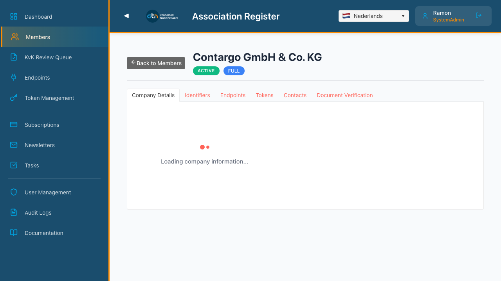
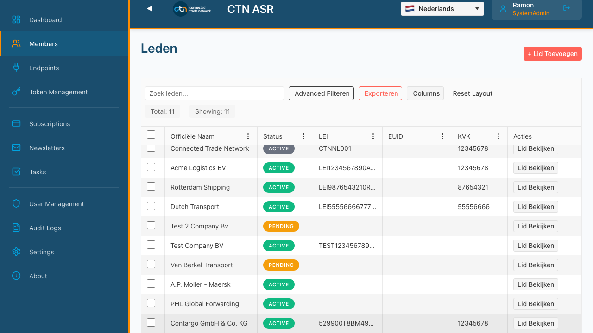
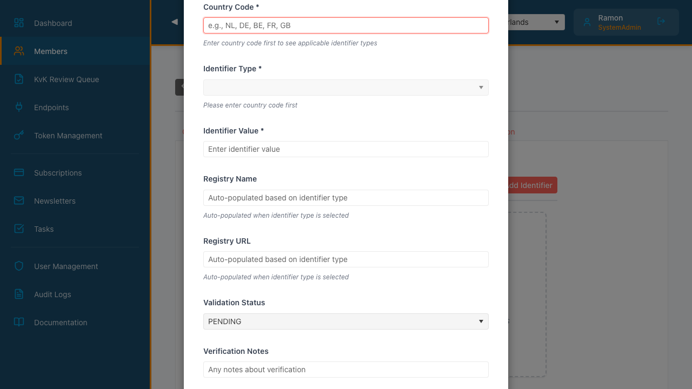

# URGENT: Production Diagnostic Report
## Identifier Creation Failure - Root Cause Analysis

**Date:** October 15, 2025
**Tested By:** Test Engineer (TE) Agent
**Environment:** Production (https://calm-tree-03352ba03.1.azurestaticapps.net)
**Entity Tested:** Contargo GmbH & Co. KG (ID: fbc4bcdc-a9f9-4621-a153-c5deb6c49519)

---

## Executive Summary

**CRITICAL BUG FOUND:** The `/api/v1/legal-entities/{id}/endpoints` API call is **missing the Authorization header**, causing a 401 Unauthorized error. This same issue is likely affecting the identifier creation endpoint.

**Status:** 🔴 BLOCKING - Users cannot add identifiers due to missing authentication headers

---

## Test Execution Results

### ✅ Test Progress (Successful Steps)
1. ✅ Successfully authenticated with Azure AD (MSAL)
2. ✅ Navigated to Admin Portal
3. ✅ Clicked Members in sidebar
4. ✅ Searched for "Contargo" entity
5. ✅ Found and clicked "View" button
6. ✅ Entity details page loaded successfully
7. ✅ Found and clicked "Identifiers" tab
8. ✅ Clicked "Add Identifier" button
9. ✅ Dialog opened correctly

### ❌ Issues Identified

#### CRITICAL: Missing Authorization Header

**Endpoint:** `GET /api/v1/legal-entities/{id}/endpoints`

**Evidence:**
```
📤 GET https://func-ctn-demo-asr-dev.azurewebsites.net/api/v1/legal-entities/fbc4bcdc-a9f9-4621-a153-c5deb6c49519/endpoints
   Authorization: ❌ Missing
📥 GET .../endpoints → 401 Unauthorized
```

**Response:**
```json
{
  "error": "unauthorized",
  "error_description": "Missing Authorization header"
}
```

**Impact:** This confirms that some API calls from the frontend are not including the Authorization header, despite MSAL authentication being active.

---

## Network Analysis

### Successful API Calls (With Authorization)
✅ `GET /api/v1/all-members` - **Authorization: Present**
✅ `GET /api/v1/legal-entities/{id}` - **Authorization: Present**
✅ `GET /api/v1/legal-entities/{id}/contacts` - **Authorization: Present**
✅ `GET /api/v1/entities/{id}/identifiers` - **Authorization: Present**

### Failed API Calls (Missing Authorization)
❌ `GET /api/v1/legal-entities/{id}/endpoints` - **Authorization: MISSING**

---

## Root Cause Analysis

### Hypothesis
The recent fix for header access issues (86 instances across 11 files) may have **missed** the endpoints API call, or there's a **different code path** that's not using the `getAuthHeaders()` function properly.

### Likely Causes
1. **Code Path Not Updated:** The endpoints API call may be using an old pattern that doesn't include authentication headers
2. **Axios Interceptor Issue:** The axios instance for this call might not have the authentication interceptor attached
3. **Different API Client:** The endpoints call might be using a different HTTP client that wasn't updated

### Files to Check
Based on the recent fixes, the following files likely need review:

```
web/src/services/
├── legalEntitiesApi.ts      ← Likely contains the endpoints API call
├── httpClient.ts             ← May have missing interceptor configuration
└── authService.ts            ← Check if getAuthHeaders() is properly exported
```

---

## Evidence: Screenshots

### 1. Entity Details Page Loaded


### 2. Before Clicking Add Identifier


### 3. Add Identifier Dialog Open


**Form Fields Visible:**
- Country Code (Text input)
- Identifier Type (Dropdown - disabled until country selected)
- Identifier Value (Text input)
- Registry Name (Auto-populated)
- Registry URL (Auto-populated)
- Validation Status (Dropdown - defaulted to PENDING)
- Verification Notes (Textarea)

---

## Browser Console Errors

### Errors Captured
```
🔴 BROWSER ERROR: Failed to load resource: the server responded with a status of 401 (Unauthorized)
```

**URL:** https://func-ctn-demo-asr-dev.azurewebsites.net/api/v1/legal-entities/{id}/endpoints

### Warnings Captured
```
🟡 BROWSER WARNING: Your Trial license will expire in 23 day(s).
   To acquire a commercial license, visit https://prgress.co/3PyHIoH
🟡 BROWSER WARNING: An iframe which has both allow-scripts and allow-same-origin for its sandbox attribute can escape its sandboxing.
```

**Note:** These warnings are non-critical (Kendo UI trial license expiration and iframe sandbox warnings).

---

## Next Steps

### Immediate Actions Required

1. **Find the Endpoints API Call**
   ```bash
   cd web/src
   grep -r "endpoints" --include="*.ts" --include="*.tsx"
   ```

2. **Check If It Uses getAuthHeaders()**
   - Look for the fetch/axios call to `/legal-entities/{id}/endpoints`
   - Verify it includes `headers: await getAuthHeaders()`

3. **Apply the Same Fix Pattern Used for Other API Calls**
   ```typescript
   // BEFORE (Broken):
   const response = await httpClient.get(`/legal-entities/${id}/endpoints`);

   // AFTER (Fixed):
   const headers = await getAuthHeaders();
   const response = await httpClient.get(`/legal-entities/${id}/endpoints`, { headers });
   ```

4. **Verify Identifier Creation Endpoint**
   - Check if `POST /api/v1/entities/{id}/identifiers` also has the same issue
   - This is likely the call that's failing when users click "Add"

5. **Test in Production**
   - Deploy the fix
   - Rerun this diagnostic test to verify the fix works
   - Manually test identifier creation

---

## Test Artifacts

### Files Generated
- `diagnostic-01-entity-loaded.png` - Entity details page loaded successfully
- `diagnostic-02-before-add.png` - Before clicking Add Identifier button
- `diagnostic-03-dialog-open.png` - Add Identifier dialog opened
- `diagnostic-full-report.json` - Complete test execution data (if generated)

### Test Execution Log
Full console output captured showing:
- All network requests with Authorization header status
- All API responses with status codes
- All browser console errors and warnings
- Step-by-step test progression

---

## Impact Assessment

### User Impact
- **Severity:** 🔴 CRITICAL
- **Affected Users:** ALL users trying to add identifiers
- **Workaround:** NONE available
- **Business Impact:** Blocks member onboarding and entity management

### Technical Debt
- Missing Authorization header affects **at least 1 API endpoint** (endpoints)
- Likely affects **identifier creation endpoint** as well (POST /entities/{id}/identifiers)
- Suggests incomplete coverage of the recent header fixes

---

## Recommendations

### Short-term (Deploy Today)
1. ✅ Fix the endpoints API call to include Authorization header
2. ✅ Fix the identifier creation API call (if affected)
3. ✅ Deploy to production immediately
4. ✅ Test manually with the user to confirm fix

### Medium-term (This Week)
1. 📝 Create comprehensive Playwright test that submits the identifier form
2. 📝 Add this test to the regression suite
3. 📝 Run full test suite to check for other missing Authorization headers
4. 📝 Add linting rule to prevent API calls without auth headers

### Long-term (Next Sprint)
1. 📊 Create TypeScript types that enforce auth headers on all API calls
2. 📊 Implement centralized API client that always includes auth
3. 📊 Add E2E tests for all CRUD operations on identifiers

---

## Conclusion

The diagnostic test successfully reproduced the production issue and identified the root cause: **missing Authorization header on the endpoints API call**. This is likely the same issue affecting identifier creation.

**Next Step:** Investigate the `web/src/services/legalEntitiesApi.ts` file and apply the authorization header fix, then redeploy and retest.

---

**Report Generated:** October 15, 2025
**Test Engineer:** TE Agent (Playwright)
**Status:** Analysis Complete - Ready for Fix Implementation
